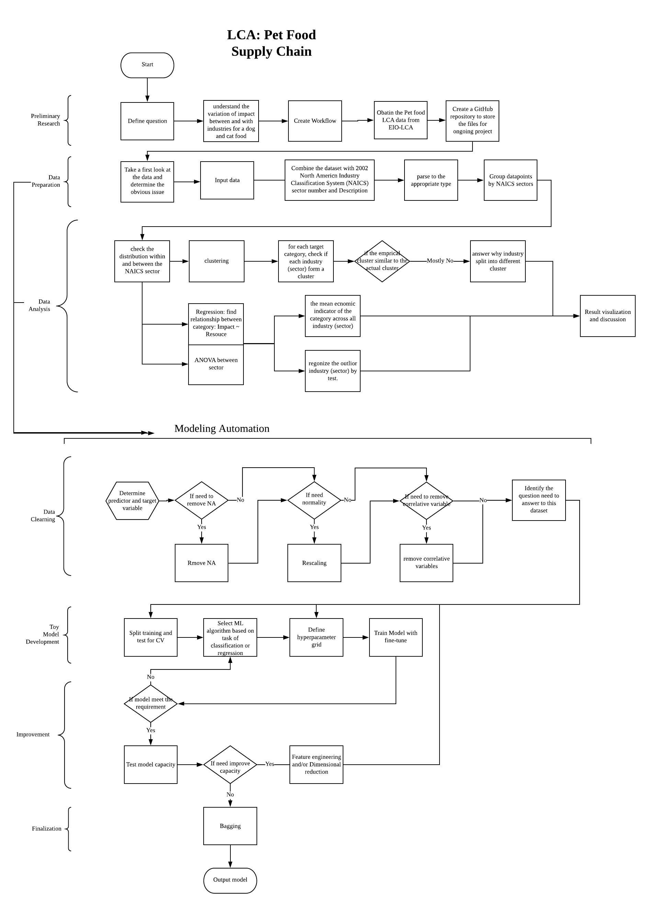

<!-- README.md is generated from README.Rmd. Please edit that file -->

```{r, include = FALSE}
knitr::opts_chunk$set(
  collapse = TRUE,
  comment = "#>",
  fig.path = "man/figures/README-",
  out.width = "100%"
)
```

# Interesting question

The goal of this project is to study the environmental impact of a certain amount of production with Economic Input-Output Life Cycle Assessment (EIO-LCA) method, which estimates activities in our economy in the materials and energy resources required for and the environmental impact resulting from. The environmental impacts involove conventional air poluten (CAP), greenhouse gass (GHG), and toix release (TOX). Cradle-to-grave is the full Life Cycle Assessment from resource extraction to use phase and disposal phase. Specificallym, this analysis is base on the Cradle-to-grave EIO-LCA result to further understand how all industrial stages of producing Million Dollars product *in Dog and Cat Food Manufacturing* (code 311111 in NAICS 2002) are different in environmental impact. The study aim to answer the following questions:

* which industry(s) have larger impact among all industries?
* what are the relationship between some impact relative to the input (ie. Energy, water withdraw)?
* how the outlier industry(s) behave in linear regression models


## Hightlight

1. for dog and cat food Manufacturing, the greatest environmental impacts come frome any raw material production industries such as agricultural farming.

2. we successfully fit linear regression model on the following environmental impact using energy and water withdraw as input:

* Emissions of Nitrogen Oxides to Air,
* Emissions of Sulfur Dioxide to Air,
* weighting of greenhouse gas emissions into the air from the production,
* Emissions of Carbon Dioxide (CO2) into the air from fossil fuel combus.

3. most of industries use either NonFossoil Eletrecity or Fossoil Eletrecity
4. for those industries using biowaste as energy source have higher impact in toxic.

## Workflow

<center>
{width=100%}
</center>

# Data description
What kind of data is avialble? How is your data collected? Are there any concerns about the data? Which data is the most relevant? Is the data easy to acccess? Will the data change over time? What needs to be done to the data to get it ready for any downstream analysis?

The dataset for this project is the first pass life cycle assessment results for cat and dog food manufacturing. It provides the environmental impact information into the pet food supply chain. The LCA data was generated through EIO-LCA website(http://www.eiolca.net/cgi-bin/dft/use.pl).  The model for getting the LCA data is US 2002 producer price benchmark. 

```{r include=FALSE, }
library(dplyr)
library(purrr)
library(kableExtra)
```

# Explore the data

After webscaping, combinding the raw data, and manually making minor modification, we result a datafarme stored as 'dat_311111_1M_v2.csv.
 
```{r}
# data input
dat <- read.csv("data/dat_311111_1M_v2.csv")

# Input columns 
X <- dat %>% 
  select(Coal.TJ, NatGase.TJ, Petrol.TJ, Bio.Waste.TJ, NonFossElec.TJ, Water.Withdrawals.Kgal)
psych::describe(X)

```

```{r}
M <- cor(X)
corrplot::corrplot(M, method="color")
```


```{r}
# target columns 
CPA <- dat %>% select(CO.t, NH3.t, NOx.t, PM10.t, PM2.5.t, SO2.t, VOC.t)
GHG <- dat %>% select(Total.t.CO2e, CO2.Fossil.t.CO2e, CO2.Process.t.CO2e, CH4.t.CO2e, HFC.PFCs.t.CO2e)
TOX <- dat %>% select(Fugitive.kg, Stack.kg, Total.Air.kg, Surface.water.kg, U_ground.Water.kg, Land.kg, Offiste.kg, POTW.Metal.kg)
ys <- cbind(CPA, GHG, TOX)
psych::describe(ys)
```

# Fit Models

## user-define function
```{r}
# test: target_nm = "CO.t"
makedata_map <- function(target_nm, dat){
  # Input columns
  Xy = dat %>%
    select(Coal.TJ, NatGase.TJ, Petrol.TJ, 
           Bio.Waste.TJ, NonFossElec.TJ, 
           Water.Withdrawals.Kgal,
           target_nm)
  # retin all inf by log(x + min/100)
  #Xy <- cbind(dat %>% select(Sector) %>% mutate(Sector= Sector %>% as.factor()), log10(Xy + min(Xy[Xy!=0])/100)) 
  # remove all inf= log(0)
  Xy <- cbind(dat %>% select(Sector), log10(Xy)) 
  Xy <- Xy[!is.infinite(rowSums(Xy)),] %>% mutate(Sector= Sector %>% as.factor())
  colnames(Xy) <- colnames(Xy) %>% stringr::str_replace_all("\\.","") 
  return(Xy)
}

bind_coef_star <- function(x) {
  if (stringr::str_detect(x[2] , "\\*")) {
    paste0(x[1], "(",x[2], ")")
  } else if (!is.na(x[1])){
    paste0(x[1])
  } else{
    ""
  }
}
```

## Linear Regression Modeling with log10 Transformation on Input and Output
```{r}
# create a dataframe with a column with impact variable names 
target_list <- tibble(target = c(colnames(CPA),colnames(GHG),colnames(TOX))); target_list

# model selection for each impact variable
bestglm_list <- target_list %>% 
  mutate(data = target %>% 
           map(function(target_nm) makedata_map(target_nm,
                                                dat= dat))) %>% 
  mutate(rowdata = data %>% map_dbl(nrow)) %>% 
  filter(rowdata > 100) %>% 
  select(-rowdata) %>% 
  mutate(top_model = data %>% 
           map(function(data) bestglm::bestglm(Xy=data %>% select_if(is.numeric), family = gaussian, method = "exhaustive", IC = "BIC", TopModels = 1))) %>% 
  mutate(best_model = top_model %>% map(function(top_model) top_model[[1]])) %>% 
  mutate(anv = best_model %>% map(anova)) %>% 
  mutate(statisics = best_model %>% purrr::map(.f = function(m) broom::glance(m))) %>% 
  tidyr::unnest(statisics)

# extract coefficient from the best model of each impact variable
coef_list <- bestglm_list %>% 
  mutate(coefs = best_model %>% purrr::map(.f=broom::tidy)) %>% 
  select(target, coefs) %>% 
  tidyr::unnest(coefs) %>% 
  select(target, term, estimate) %>% 
  tidyr::spread(key= term, value = estimate)

# extract p-value for each paramters of the best model of each impact variable
signif_list <- bestglm_list %>% 
  mutate(coefs = best_model %>% purrr::map(.f=broom::tidy)) %>% 
  select(target, coefs) %>% 
  tidyr::unnest(coefs) %>% 
  select(target, term, p.value) %>% 
  tidyr::spread(key= term, value = p.value)

# combind coefficient and p-value to result in a tidy table of the result
datArray <- abind::abind(coef_list %>% 
                           select(-target) %>% 
                           mutate_if(is.numeric, signif, digits = 3) %>% 
                           mutate_all(as.character),
                         signif_list %>% 
                           select(-target) %>% 
                           mutate_if(is.numeric, gtools::stars.pval),along=3)
coef_signif_list <- bestglm_list %>% 
  select(target, r.squared, adj.r.squared, p.value) %>% 
  cbind(apply(datArray,1:2, bind_coef_star) %>% as_tibble())

# result
knitr::kable(coef_signif_list)
```

# Communciate and visualize the results

## The linear model with R^2 >0.75
```{r}
good_lm <- bestglm_list %>% filter(adj.r.squared >0.75); good_lm %>% arrange(desc(adj.r.squared))
```

## The diagnosis of linear model
```{r}
par(mfrow=c(2,3))
plot(good_lm$best_model[[1]], which=1:6)
plot(good_lm$best_model[[2]], which=1:6)
plot(good_lm$best_model[[3]], which=1:6)
plot(good_lm$best_model[[4]], which=1:6)
plot(good_lm$best_model[[5]], which=1:6)
plot(good_lm$best_model[[6]], which=1:6)
plot(good_lm$best_model[[7]], which=1:6)
```

# Result
## Impact between Sector 

```{r}
# descriptive analysis
good_lm$target
# NOx.t: Emissions of Nitrogen Oxides to Air from each sector. t = meric tons
# SO2.t: Emissions of Sulfur Dioxide to Air from each sector. t = meric tons 
# Total.t.CO2e: Global Warming Potential (GWP) is a weighting of greenhouse gas emissions into the air from the production of each sector. Weighting factors are 100-year GWP values from the IPCC Second Assessment Report (IPCC 2001). t CO2e = metric tons of CO2 equivalent emissions. 
# CO2.Fossil.t.CO2e	C: Emissions of Carbon Dioxide (CO2) into the air from each sector from fossil fuel combustion sources. t CO2e = metric tons of CO2 equivalent.

par(mfrow=c(1,2))
plot(good_lm$data[[1]][,ncol(good_lm$data[[1]])])
plot(good_lm$data[[1]][,1], good_lm$data[[1]][,ncol(good_lm$data[[1]])])

plot(good_lm$data[[2]][,ncol(good_lm$data[[2]])])
plot(good_lm$data[[2]][,1], good_lm$data[[2]][,ncol(good_lm$data[[2]])])

plot(good_lm$data[[3]][,ncol(good_lm$data[[3]])])
plot(good_lm$data[[3]][,1], good_lm$data[[3]][,ncol(good_lm$data[[3]])])

plot(good_lm$data[[4]][,ncol(good_lm$data[[4]])])
plot(good_lm$data[[4]][,1], good_lm$data[[4]][,ncol(good_lm$data[[4]])])
```
