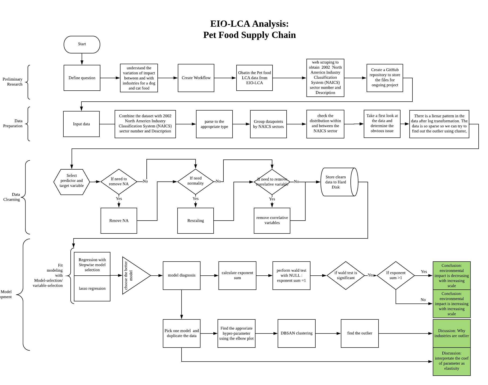

<!-- README.md is generated from README.Rmd. Please edit that file -->

```{r, include = FALSE}
knitr::opts_chunk$set(
  collapse = TRUE,
  comment = "#>",
  fig.path = "man/figures/README-",
  out.width = "100%"
)
```


# Background information
According to the APPA (American Pet Product Association) 2019-2020 pet owner survey, around 84.9 million U.S. households own pet, which is about 67% of the U.S. homes (APPA, 2019). In 2018, the U.S. customer spent 72.56 billion dollars on their pets, of which 30.32 billion dollars is for pet food. From a 2017 U.S. pet owners survey, 2% of dog and cat owners select their pet food based on product claim of sustainable or eco-friendly pet food formula. Although the percentage is low, the interest in the sustainability of the pet food has grown a lot recently. 

# Interesting question

The goal of this project is to study the environmental impact of a certain amount of production with Economic Input-Output Life Cycle Assessment (EIO-LCA) method, which estimates activities in our economy in the materials and energy resources required for and the environmental impact resulting from. The environmental impacts involve conventional air poluten (CAP), greenhouse gass (GHG), and toix release (TOX). Cradle-to-grave is the full Life Cycle Assessment from resource extraction to use phase and disposal phase. Specificallym, this analysis is base on the Cradle-to-grave EIO-LCA result to further understand how all industrial stages of producing Million Dollars product *in Dog and Cat Food Manufacturing* (code 311111 in NAICS 2002) are different in environmental impact. The study aim to answer the following questions:

1. as the pet food economic growth, how does increase in production inflence the environmental impacts, by assuming input of resource and output of production are proportional.
3. Is there any industry(s) has extraordinary environmental impact compared to other?

# Hightlight of result

* on average, by increasing pet food production by 1%, most environmental impacts increase by more than 1%, but toxic increase by less than 1%
* in pet food manufacturing, the greatest environmental impacts come from agricultural farming sector, and the utility sector of Electric Power Generation, Transmission and Distribution.
* the industries using biowaste energy have higher impact in toxic.

# Data description
The dataset for this project is the first pass life cycle assessment results for cat and dog food manufacturing. It provides the environmental impact information into the pet food supply chain. The LCA data was generated through EIO-LCA website(http://www.eiolca.net/cgi-bin/dft/use.pl).  The model for getting the LCA data is US 2002 producer price benchmark. In order to get the dog and cat food manufacturing LCA data, the user needs to select “Food beverage and tobacco” sector group, dog and cat food manufacturing sector and then the amount of economic activity for this sector(e.g. 1 millon dollars). After setting up the sector and economic parameters, The user could select different economical and environmental impact to get the LCA results.
The LCA results are ready for downloading as excel files. The raw data was lacking the columns name for different impact feature and index for identifying the different sectors and sector group. The web scraping is necessary for the columns name and NAICS sector code. 

# Workflow

<center>
{width=100%}
</center>

```{r pkg, include=FALSE}
library(dplyr)
library(purrr)
library(kableExtra)
library(plotly)
library(RColorBrewer)
library(ggplot2)
```

# Explore the data

After webscaping, combinding the raw data, and manually making minor modification, we result a datafarme stored as 'dat_311111_1M_v2.csv.
 
```{r read_csv}
# data input
dat <- read.csv("data/dat_311111_1M_v2.csv")
dim(dat)
```

```{r clearData}
# calculate and rename
calculate_formula_replace_nm <- function(data, formula = y~1000*x, pattern= pattern, replacement= replacement){
  
  calculate_formula<- function(data, formula = formula){
    as.function <- function(formula) {
      cmd <- tail(as.character(formula),1)
      exp <- parse(text=cmd)
      function(...) eval(exp, list(...))
    }
    formula.function <- as.function(formula)
    result<- formula.function(x=data)
    return(result)
  }
  data <- data %>% dplyr::mutate_all(calculate_formula, formula = formula) %>% 
    stats::setNames(stringr::str_replace_all(names(.), pattern= pattern, replacement= replacement )) 
  return(data)
}
# piping: Sort environment impact group and input resouce, unit convertion to result no 0<.<1, rename by unit
CPA <- dat %>% select(CO.t, NH3.t, NOx.t, PM10.t, PM2.5.t, SO2.t, VOC.t) %>% 
  calculate_formula_replace_nm(formula = y~x*10^6, pattern= "\\.t", replacement= ".g")
GHG <- dat %>% select(Total.t.CO2e, CO2.Fossil.t.CO2e, CO2.Process.t.CO2e, CH4.t.CO2e, HFC.PFCs.t.CO2e) %>% 
  calculate_formula_replace_nm(formula = y~x*10^6, pattern= "\\.t", replacement= ".g")
TOX <- dat %>% select(Fugitive.kg, Stack.kg, Total.Air.kg, Surface.water.kg, U_ground.Water.kg, Land.kg, Offiste.kg, POTW.Metal.kg) %>% 
  calculate_formula_replace_nm(formula = y~x*10^6, pattern= "\\.kg", replacement= ".mg")
resource <- dat %>% select(Coal.TJ, NatGase.TJ, Petrol.TJ,Bio.Waste.TJ, NonFossElec.TJ, Water.Withdrawals.Kgal) %>% 
  calculate_formula_replace_nm(formula = y~x*10^6, pattern= "\\.TJ", replacement= ".MJ")
ID <- dat %>% select(Sector, Description, name_sub, Sector_sub) %>% mutate_all(as.factor)
dat <- cbind(ID, CPA, GHG, TOX, resource)

# summary statistic for X variable
ys <- cbind(CPA, GHG, TOX)
psych::describe(ys) %>% knitr::kable(format = "markdown") 
```

## Correlation

Observation from correlation plot

* The scatter plots show most information are concentrate at the origin of the feature space, but sparse anywhere else (heteroskedastic);
* The distribution plots show variables are highly skewed (not normally distributed);
* The spearman correlations show that most independent variables are moderate correlative, but some are unlikly and some are likly correlative (multicollinearity).

```{r corplot}
# raw X variable
psych::pairs.panels(resource, method = "spearman")
```

The data is suitable for log transformation and could be modelled in LogLog transformation. 

con

* the interpretation of each parameter distorted from scalar to ratio of the scalar quantity (i.e. For regressions, the coefficent is interpret as the reletive change, in clusterings, the cluster is the group of same magnitude).
* it is not able to fix the issue of multicollinearity, so variable/model selection are required.

pro

* the information at the origin can be stretched out.  
* the resulting linear regression can be interpreted at elastisity (similar to the idea cobb-douglas utility function in Econometrics)

```{r corplot_LN}
# Ln X variable
psych::pairs.panels(log(resource+1), method = "spearman")
```


```{r GHG_TotalCO2, eval=FALSE, include=FALSE}
# Define the number of colors you want
nb.cols <- dat$Sector %>% unique() %>% length()
mycolors <- colorRampPalette(brewer.pal(8, "Set2"))(nb.cols)

# calculate with formula only
calculate_formula <- function(data, formula = y~1000*x){
  as.function <- function(formula) {
    cmd <- tail(as.character(formula),1)
    exp <- parse(text=cmd)
    function(...) eval(exp, list(...))
  }
  formula.function <- as.function(formula)
  result<- formula.function(x=data)
  return(result)
}

X <- resource %>% 
  select(Coal.MJ, Petrol.MJ, NatGase.MJ) %>% 
  mutate_all(calculate_formula, formula = y~x+1)
y <- GHG %>% select(Total.g.CO2e)
dat_GHG_TotalCO2 <- cbind(ID, y, X)

p <- plot_ly(dat_GHG_TotalCO2, 
             x = ~Coal.MJ, 
             y = ~Petrol.MJ, 
             z = ~NatGase.MJ,
             hovertemplate = paste('<b>%{text}</b>',
                                   '<br>Coal.MJ: %{x}',
                                   '<br>Petrol.MJ: %{y}',
                                   '<br>atGase.MJ: %{z}'),
             color = ~Sector, 
             colors = mycolors,
             marker = list(symbol = 'circle',
                           sizemode = 'diameter'),
             size = ~Total.g.CO2e,
             sizes = c(5,150),
             text = ~paste('<br>Sector:', Sector, 
                           '<br>Description:', Description, 
                           '<br>Sector_sub:', Sector_sub, 
                           '<br>name_sub:', name_sub,
                           '<br>Total.g.CO2e:', Total.g.CO2e)) %>%
  layout(title = 'Total CO2 equivalent vs Energy source (Coal, Petrol, NatGase) <br> by NAICS 2002 Sectors',
         scene = list(xaxis = list(title = 'Coal.MJ',
                                   gridcolor = 'rgb(255, 255, 255)',
                                   type = 'log'),
                      yaxis = list(title = 'Petrol.MJ',
                                   gridcolor = 'rgb(255, 255, 255)',
                                   type = 'log'),
                      zaxis = list(title = 'NatGase.MJ',
                                   gridcolor = 'rgb(255, 255, 255)',
                                   type = 'log')),
         paper_bgcolor = 'rgb(243, 243, 243)',
         plot_bgcolor = 'rgb(243, 243, 243)',
         annotations = list(x = 1.07,
                            y = 1.015,
                            text = 'Sector by NAICS 2002',
                            showarrow = FALSE)); p
```


```{r plotly_GHG_TotalCO2, eval=FALSE, include=FALSE}
htmlwidgets::saveWidget(ggplotly(p),
                        file ="plotly_GHG_TotalCO2.html")
```

Let's take a look at the visulization of plot with 5-dimemtions: Total CO2 Equvivalent as the target variable (size) by Sectors (color), three log10 scaled input resources as input variables (x,y,z)  ( [HERE](https://weiquanluo.github.io/img/plotly_GHG_TotalCO2.html)).

# Regression

We are going to natural log transform both X and Y and fit regression models to each of 20 environmental impact variables. The six input resouce vairables consist of Coal.MJ, NatGase.MJ, Petrol.MJ, Bio.Waste.MJ, NonFossElec.MJ, and Water.Withdrawals.Kgal. The environmental impact variables are 7 variables for conventional air polutant, 5 variables for greenhouse gases, 8 variables for Toxic. Druding the data processing, if the count of datapoint for a target variable is less than 100, then we abandon the corresponding models. After data processing and stepwise model selections, it result 16 model candidates, where one for each valid target variable. The following user-defined function are prepared for functional programming with using purrr style lamda function.

## User-defined Functions
```{r udfunc}
# test: target_nm = "Total.g.CO2e",  X = resource
makedata_map <- function(target_nm, dat, X){
  # loglog transform
  y <- dat %>% select(target_nm)
  Lny <- log(y) %>% stats::setNames(paste0("Ln", names(.)))
  LnX <- log(X+1) %>% stats::setNames(paste0("Ln", names(.)))
  # combine, filter log(y)=0; add ID:Sector
  Xy <- cbind(LnX, Lny)
  Xy <- cbind(dat %>% select(Sector, Description, name_sub, Sector_sub), Xy) 
  Xy <- Xy[!is.infinite(rowSums(Lny)),]
  colnames(Xy) <- colnames(Xy) %>% stringr::str_replace_all("\\.","") 
  return(Xy)
}
fit_model <- function(data){
  best_model <- bestglm::bestglm(Xy=data %>% 
                                   select_if(is.numeric), 
                                 family = gaussian, 
                                 method = "exhaustive", 
                                 IC = "AIC", 
                                 TopModels = 1)
  return(best_model[[1]])
}
bind_coef_star <- function(x) {
  if (stringr::str_detect(x[2] , "\\*")) {
    paste0(x[1], "(",x[2], ")")
  } else if (!is.na(x[1])){
    paste0(x[1])
  } else{
    ""
  }
}
# test: model <- bestglm_list$best_model[[1]], null <- 1
waldtest_map <- function(model, null= NULL){
  test.terms <- paste0("~", names(coef(model))[-1] %>% paste(collapse = "+")) %>% 
    as.formula()
  test_result <- survey::regTermTest(model = model, test.terms ,null = null)
  pval_wald <- test_result[['p']] %>% as.numeric()
  return(pval_wald)
}
```

## LogLog Linear Regression

```{r glm_fit}
# create a dataframe with a column with impact variable names 
target_list <- tibble(target = c(colnames(CPA),colnames(GHG),colnames(TOX))); target_list %>% flatten() %>% unlist()

# piping: variale selection, anova, extract statistic, wald test
bestglm_list <- target_list %>% 
  mutate(data = target %>% 
           map(function(target_nm) makedata_map(target_nm,
                                                dat= dat, 
                                                X = resource))) %>% 
  mutate(rowdata = data %>% map_dbl(nrow)) %>% 
  filter(rowdata > 100) %>% 
  select(-rowdata) %>% 
  mutate(best_model = data %>% map(fit_model)) %>% 
  mutate(anv = best_model %>% map(anova)) %>% 
  mutate(statisics = best_model %>% purrr::map(.f = function(m) broom::glance(m))) %>% 
  tidyr::unnest(statisics) %>% 
  mutate(wald_pval = best_model %>% 
           purrr::map_dbl(function(model) waldtest_map(model= model, null= 1))) %>% 
  mutate(nrows_data = data %>% purrr::map_dbl(nrow)) %>% 
  arrange(desc(adj.r.squared))
# extract coef from each model
coef_list <- bestglm_list %>% 
  mutate(coefs = best_model %>% purrr::map(.f=broom::tidy)) %>% 
  select(target, coefs) %>% 
  tidyr::unnest(coefs) %>% 
  select(target, term, estimate) %>% 
  tidyr::spread(key= term, value = estimate)
# extract pval for all coef from each model
signif_list <- bestglm_list %>% 
  mutate(coefs = best_model %>% purrr::map(.f=broom::tidy)) %>% 
  select(target, coefs) %>% 
  tidyr::unnest(coefs) %>% 
  select(target, term, p.value) %>% 
  tidyr::spread(key= term, value = p.value)
# combind coef and pval for visual
coef_signif_list <- coef_list %>% 
  select(target) %>% 
  cbind(apply(abind::abind(coef_list %>% 
                             select(-target) %>% 
                             mutate_if(is.numeric, signif, digits = 3) %>% 
                             mutate_all(as.character),
                           signif_list %>% 
                             select(-target) %>% 
                             mutate_if(is.numeric, gtools::stars.pval),along=3),
              1:2, bind_coef_star))
# add statistic to the coef and pval
coef_signif_list <- bestglm_list %>% 
  select(target, adj.r.squared, p.value, wald_pval) %>% 
  mutate_at(c("adj.r.squared", "p.value", "wald_pval"), signif, digits = 3) %>% 
  left_join(coef_signif_list, by="target")
# get exponent_sum
coef_signif_list$exponent_sum <- coef_list[,3:8] %>% rowSums(na.rm = TRUE) %>% signif(digits = 3)
```

```{r coef_signif_list}
# result
coef_signif_list %>% 
  arrange(desc(adj.r.squared)) %>% 
  knitr::kable(format = "markdown") 
```

The following linear model with R^2 >0.75

```{r goodmodel}
good_lm <- bestglm_list %>% filter(adj.r.squared >0.75)
good_lm %>% arrange(desc(adj.r.squared)) %>% select(target) %>% flatten() %>% unlist
```

## Diagnosis for GHG CO2 Equvivalent model:

The variable `Total.t.CO2e` refer to the Global Warming Potential (GWP), which is a weighting of greenhouse gas emissions into the air from the production of each sector. Weighting factors are 100-year GWP values from the IPCC Second Assessment Report (IPCC 2001). t CO2e = metric tons of CO2 equivalent emissions. For the resulting regression model, We see some issue from the diagnosis plot:

* linearity: there some pattern in the residual plot, so it suggest some other transformation. The linearity assumption seems to be violated, so some further transformation is required.
* normality: the quantile plot show that the residual are not normally distribute at the tail section, which suggest some influential points, but is the least concern because we have sufficient sample size.
* Constant variance: Scale-lacation plot show a increasing variance. It suggests that we can use this regression to interpret the relationship between x and y, but not to make prediction, because the confident interval increase as the predictive value increase.

```{r diagsis}
par(mfrow=c(2,3))
plot(good_lm$best_model[[2]], which=1:6)
```

### Added-variable plots 

We use added-variable plots for influence analysis to check the existance of any influential points. We can see some points are considered to be influential points, such as 1, 37, 39 66, 78, 331, 318.

```{r avplot}
car::avPlots(bestglm_list$best_model[[2]])
```


### Partial-residual plots

we use partial-residual plots to reveal nonlinearity. All partial-residual plots did not show a obvious curve pattern, but we might keep the eyes on leaakge effect by `LnNonFossElecMJ` and `LnBioWasteMJ`. 

```{r prplot}
car::crPlots(bestglm_list$best_model[[2]])
```

## Random effect: Impact among sectors

```{r}
par(mfrow=c(1,2))
i=2
good_lm$data[[i]][,ncol(good_lm$data[[i]])] %>% boxplot()
plot(good_lm$data[[i]][,1], good_lm$data[[i]][,ncol(good_lm$data[[i]])])
```

```{r}
# random effect model
data_anv <- good_lm$data[[2]] %>% select(-Description,-name_sub, -Sector_sub)
model.rand_block <- nlme::lme(data = data_anv,
                     LnTotalgCO2e ~ LnBioWasteMJ + LnCoalMJ + LnNatGaseMJ + LnNonFossElecMJ + LnPetrolMJ,
                     random = ~1|Sector)
# anova(model.rand_block)
# fixed effect model
model.fixed = nlme::gls(data = data_anv,
                  LnTotalgCO2e ~ LnBioWasteMJ + LnCoalMJ + LnNatGaseMJ + LnNonFossElecMJ + LnPetrolMJ,
                  method="REML")
# anova(model.fixed)
# Test the random effects in the model
anova(model.rand_block, model.fixed)
```

The extremely small p-value in testing random effect suggest that there are significant difference in green house gases CO2 equivalence among sectors. However, random effect model are usually has less mse than fixed effect model.

## Interaction effect

The concern of variable interaction effect (effect modification) have not been tested for the regression. The best practise is to exam the interaction effect during model selection stage. So future research is required. 

# Clustering for CO2 Equvivalent

For instance, we are interested in what the outlier industries in producing CO2 Equvivalent. In general, we need to be extremely careful to rescaling data for distance based modeling that is sensitive to the distance between datapoints. From the above analysis, we understand this data is suitable in log scale. With considerations, we maintain the log transformation in the following distance based modeling, for reason of consistency and explanatory power. At this section, we are going to cluster the the relative size (or magnitude) of Greenhouse gases CO2 Equvivalent among all industries, instead of the scalar quantity. We used a DBSCANS algorithm to cluster the industries with magnitude of green house gases CO2 equivalence and the magnitude of the six input sources variable. The clearn log-transformed data of fitting CO2 Equvivalent linear regression is obtained from the `bestglm_list` object above. Then, we feed this log-transformed data to the cluster algorithm in python.

```{r dat_ghg}
# input data to clustering using python
dat_ghg_total_co2e <-bestglm_list %>% filter(target =="Total.g.CO2e") %>% select(data)
dat_ghg_total_co2e <- dat_ghg_total_co2e[[1]][[1]]
dat_ghg <- dat_ghg_total_co2e[,-c(1:4)]
dat_ghg %>% head %>% knitr::kable(format = "markdown") 
```

```{r use_python}
# use python3 engine
library(reticulate)
use_python("/usr/local/bin/python3")
```

```{python package}
# data type
import pandas as pd
import numpy as np
# visualization
import seaborn as sns
import matplotlib.pyplot as plt
import collections
from scipy.cluster.hierarchy import linkage, fcluster, dendrogram
# fit model
from sklearn.cluster import DBSCAN
```

```{python getX}
# input
dat_ghg = r.dat_ghg
dat_ghg1 = dat_ghg.iloc[:,1:]
```

## Dendrogram

To understand how the magnitude are different among industries, we first perform and single linked hierarchical clustering to see any possible pattern. From the following dendrogram, we see there obviously two cluster. We assume that the smaller cluster is the group of outliers.

```{python dendrogram}
# dendrogram
Z = linkage(dat_ghg1, method='single')
plt.figure(figsize=(15,15))
dendrogram(Z) 
plt.yscale('symlog')
plt.show()
```

## DBSCAN

To better seperate those outliers from the main cluster, we decide to use DBSCAN to cluster the data.


```{python elbow}
# Elbow plot: number of instance in cluster by hyperparameter eps
count = []
for i in np.arange(0.01, 5, 0.01): 
    clustering = DBSCAN(eps= i).fit(dat_ghg1)
    a = clustering.labels_
    b = collections.Counter(a).get(-1)
    count.append(b)
plt.plot(pd.Series(np.arange(0.01, 5, 0.01)),count)
```

We decide to use eps = 4 for DBSCANS.

```{python fit model}
Cluster_ghg = DBSCAN(eps=4).fit(dat_ghg1)
cluster_labels = Cluster_ghg.labels_
```

## Visualize clusters

```{r cluster_point_plot}
dat_ghg_total_co2e$sector <- dat_ghg_total_co2e$Description
dat_ghg_total_co2e$labels <- py$cluster_labels %>% as.factor()
p <- ggplot(data = dat_ghg_total_co2e, 
            aes(text = paste("sub_Sector:", name_sub))) + 
  geom_point(aes(x = sector, 
                 y = LnTotalgCO2e, 
                 color = labels)) +
  coord_flip() + 
  theme(text = element_text(size=8)); p
```

```{r cluster_point_plot_ly, include=FALSE}
htmlwidgets::saveWidget(ggplotly(p),
                        file ="ghg_total_co2e_cluster.html")
```

([HERE](https://weiquanluo.github.io/img/ghg_total_co2e_cluster.html) for interactive plot)


```{r plotly_3dscater_cluster, include=FALSE}
source("code_plotly_GHG_TotalCO2_wcluster.R")
```

Let's take a look at the visulization of plot with 5-dimemtions: Total CO2 Equvivalent as the target variable (size) three log10 scaled input resources as input variables (x,y,z) by clusters (shape) ([HERE](https://weiquanluo.github.io/img/plotly_GHG_TotalCO2_wcluster.html)).

# Discussion

# Final Note

The challenges of this project:

* Manage data multicollinearity, heteroskedastic, highly right skewed.
* Piping data processing, functional programming, statistic extraction
* Communication between data processing in R and machine learning in python


# Exercise

Please, click [HERE]() to Exercise.
