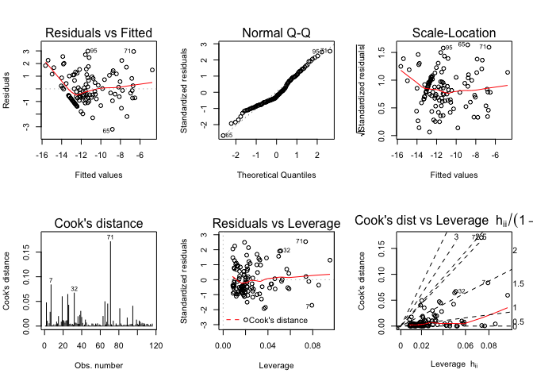
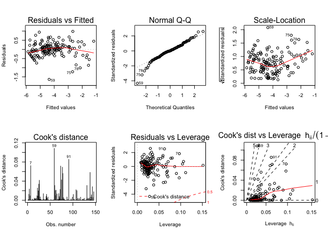
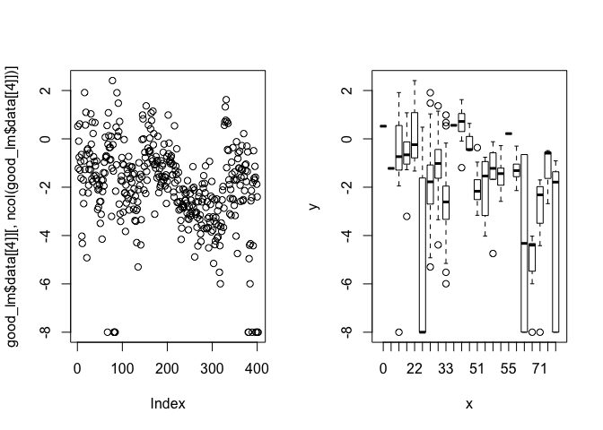
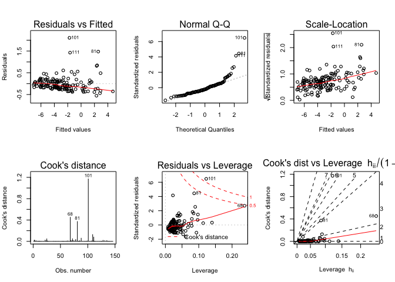
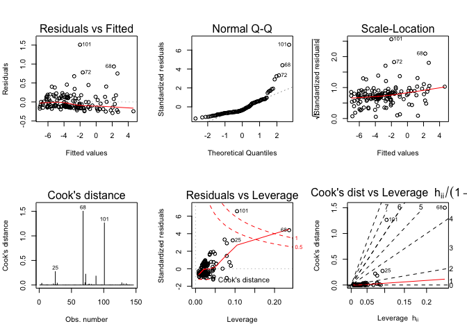
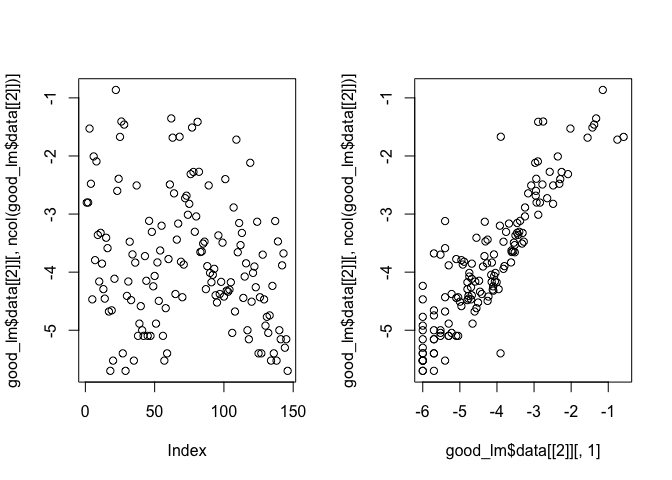
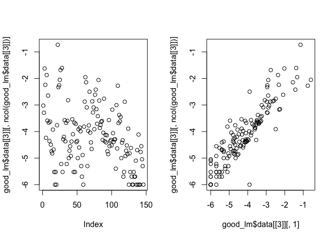
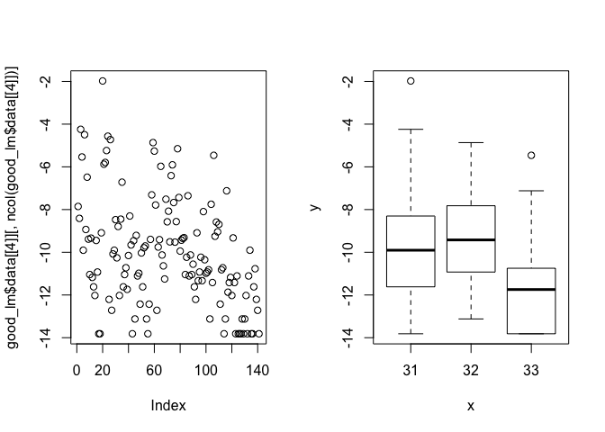

<!-- README.md is generated from README.Rmd. Please edit that file -->

# Interesting question

The goal of this project is to study the environmental impact of a
certain amount of production with Economic Input-Output Life Cycle
Assessment (EIO-LCA) method, which estimates activities in our economy
in the materials and energy resources required for and the environmental
impact resulting from. The environmental impacts involove conventional
air poluten (CAP), greenhouse gass (GHG), and toix release (TOX).
Cradle-to-grave is the full Life Cycle Assessment from resource
extraction to use phase and disposal phase. Specificallym, this analysis
is base on the Cradle-to-grave EIO-LCA result to further understand how
all industrial stages of producing Million Dollars product *in Dog and
Cat Food Manufacturing* (code 311111 in NAICS 2002) are different in
environmental impact. The study aim to answer the following questions:

  - which industry(s) have larger impact among all industries?
  - what are the relationship between some impact relative to the input
    (ie. Energy, water withdraw)?
  - how the outlier industry(s) behave in linear regression models

## Hightlight

1.  for dog and cat food Manufacturing, the greatest environmental
    impacts come frome any raw material production industries such as
    agricultural farming.

2.  we successfully fit linear regression model on the following
    environmental impact using energy and water withdraw as input:

<!-- end list -->

  - Emissions of Nitrogen Oxides to Air,
  - Emissions of Sulfur Dioxide to Air,
  - weighting of greenhouse gas emissions into the air from the
    production,
  - Emissions of Carbon Dioxide (CO2) into the air from fossil fuel
    combus.

<!-- end list -->

3.  most of industries use either NonFossoil Eletrecity or Fossoil
    Eletrecity
4.  for those industries using biowaste as energy source have higher
    impact in toxic.

## Workflow

<center>


</center>

# Data description

The dataset for this project is the first pass life cycle assessment
results for cat and dog food manufacturing. It provides the
environmental impact information into the pet food supply chain. The LCA
data was generated through EIO-LCA
website(<http://www.eiolca.net/cgi-bin/dft/use.pl>). The model for
getting the LCA data is US 2002 producer price benchmark. In order to
get the dog and cat food manufacturing LCA data, the user needs to
select “Food beverage and tobacco” sector group, dog and cat food
manufacturing sector and then the amount of economic activity for this
sector(e.g. 1 millon dollars). After setting up the sector and economic
parameters, The user could select different economical and environmental
impact to get the LCA results. The LCA results are ready for downloading
as excel files. The raw data was lacking the columns name for different
impact feature and index for identifying the different sectors and
sector group. The web scraping is necessary for the columns name and
NAICS sector code.

# Explore the data

After webscaping, combinding the raw data, and manually making minor
modification, we result a datafarme stored as ’dat\_311111\_1M\_v2.csv.

``` r
# data input
dat <- read.csv("data/dat_311111_1M_v2.csv")
# Input columns 
X <- dat %>% 
  select(Coal.TJ, NatGase.TJ, Petrol.TJ, Bio.Waste.TJ, NonFossElec.TJ, Water.Withdrawals.Kgal)
psych::describe(X)
#>                        vars   n   mean      sd median trimmed  mad min
#> Coal.TJ                   1 402   0.01    0.12   0.00    0.00 0.00   0
#> NatGase.TJ                2 402   0.01    0.08   0.00    0.00 0.00   0
#> Petrol.TJ                 3 402   0.01    0.07   0.00    0.00 0.00   0
#> Bio.Waste.TJ              4 402   0.00    0.01   0.00    0.00 0.00   0
#> NonFossElec.TJ            5 402   0.00    0.03   0.00    0.00 0.00   0
#> Water.Withdrawals.Kgal    6 402 446.14 7894.36   0.04    0.53 0.06   0
#>                              max     range  skew kurtosis     se
#> Coal.TJ                     2.32      2.32 19.34   379.42   0.01
#> NatGase.TJ                  1.37      1.37 13.88   217.66   0.00
#> Petrol.TJ                   1.09      1.09 13.11   195.82   0.00
#> Bio.Waste.TJ                0.18      0.18 10.27   114.44   0.00
#> NonFossElec.TJ              0.42      0.42 13.11   200.38   0.00
#> Water.Withdrawals.Kgal 158030.55 158030.55 19.79   391.97 393.73
```

``` r
M <- cor(X)
corrplot::corrplot(M, method="color")
```


``` r
# target columns 
CPA <- dat %>% select(CO.t, NH3.t, NOx.t, PM10.t, PM2.5.t, SO2.t, VOC.t)
GHG <- dat %>% select(Total.t.CO2e, CO2.Fossil.t.CO2e, CO2.Process.t.CO2e, CH4.t.CO2e, HFC.PFCs.t.CO2e)
TOX <- dat %>% select(Fugitive.kg, Stack.kg, Total.Air.kg, Surface.water.kg, U_ground.Water.kg, Land.kg, Offiste.kg, POTW.Metal.kg)
ys <- cbind(CPA, GHG, TOX)
psych::describe(ys)
#>                    vars   n mean    sd median trimmed  mad min    max  range
#> CO.t                  1 402 0.02  0.30   0.00    0.00 0.00   0   5.89   5.89
#> NH3.t                 2 402 0.01  0.14   0.00    0.00 0.00   0   2.69   2.69
#> NOx.t                 3 402 0.01  0.05   0.00    0.00 0.00   0   0.71   0.71
#> PM10.t                4 402 0.02  0.29   0.00    0.00 0.00   0   5.70   5.70
#> PM2.5.t               5 402 0.00  0.07   0.00    0.00 0.00   0   1.38   1.38
#> SO2.t                 6 402 0.01  0.06   0.00    0.00 0.00   0   1.08   1.08
#> VOC.t                 7 402 0.00  0.04   0.00    0.00 0.00   0   0.72   0.72
#> Total.t.CO2e          8 402 3.82 30.77   0.02    0.12 0.03   0 512.17 512.17
#> CO2.Fossil.t.CO2e     9 402 1.83 14.41   0.02    0.09 0.02   0 257.56 257.56
#> CO2.Process.t.CO2e   10 402 0.12  1.30   0.00    0.00 0.00   0  18.93  18.93
#> CH4.t.CO2e           11 402 0.55  5.90   0.00    0.00 0.00   0 108.46 108.46
#> HFC.PFCs.t.CO2e      12 402 0.02  0.25   0.00    0.00 0.00   0   4.16   4.16
#> Fugitive.kg          13 402 0.12  0.92   0.00    0.00 0.00   0  12.19  12.19
#> Stack.kg             14 402 0.42  2.73   0.00    0.01 0.00   0  33.32  33.32
#> Total.Air.kg         15 402 0.54  3.45   0.00    0.01 0.00   0  37.09  37.09
#> Surface.water.kg     16 402 0.13  1.06   0.00    0.00 0.00   0  16.40  16.40
#> U_ground.Water.kg    17 402 0.06  0.56   0.00    0.00 0.00   0   8.84   8.84
#> Land.kg              18 402 0.30  3.28   0.00    0.00 0.00   0  59.73  59.73
#> Offiste.kg           19 402 0.12  0.99   0.00    0.00 0.00   0  18.39  18.39
#> POTW.Metal.kg        20 402 0.00  0.00   0.00    0.00 0.00   0   0.04   0.04
#>                     skew kurtosis   se
#> CO.t               19.52   384.80 0.01
#> NH3.t              18.08   341.44 0.01
#> NOx.t               9.98   106.60 0.00
#> PM10.t             19.67   388.60 0.01
#> PM2.5.t            19.45   382.60 0.00
#> SO2.t              17.91   339.19 0.00
#> VOC.t              15.18   251.89 0.00
#> Total.t.CO2e       13.30   198.04 1.53
#> CO2.Fossil.t.CO2e  14.83   248.47 0.72
#> CO2.Process.t.CO2e 12.41   160.89 0.06
#> CH4.t.CO2e         15.92   278.75 0.29
#> HFC.PFCs.t.CO2e    13.62   201.15 0.01
#> Fugitive.kg        11.03   130.44 0.05
#> Stack.kg            8.71    82.72 0.14
#> Total.Air.kg        8.38    73.86 0.17
#> Surface.water.kg   12.74   175.01 0.05
#> U_ground.Water.kg  12.13   164.86 0.03
#> Land.kg            15.78   271.04 0.16
#> Offiste.kg         16.01   285.76 0.05
#> POTW.Metal.kg       7.48    61.88 0.00
```

# Clustering for the data

# Fit Models

## user-define function

``` r
# test: target_nm = "CO.t"
makedata_map <- function(target_nm, dat){
  # Input columns
  Xy = dat %>%
    select(Coal.TJ, NatGase.TJ, Petrol.TJ, 
           Bio.Waste.TJ, NonFossElec.TJ, 
           Water.Withdrawals.Kgal,
           target_nm)
  # retin all inf by log(x + min/100)
  #Xy <- cbind(dat %>% select(Sector) %>% mutate(Sector= Sector %>% as.factor()), log10(Xy + min(Xy[Xy!=0])/100)) 
  # remove all inf= log(0)
  Xy <- cbind(dat %>% select(Sector), log(Xy)) 
  Xy <- Xy[!is.infinite(rowSums(Xy)),] %>% mutate(Sector= Sector %>% as.factor())
  colnames(Xy) <- colnames(Xy) %>% stringr::str_replace_all("\\.","") 
  return(Xy)
}
bind_coef_star <- function(x) {
  if (stringr::str_detect(x[2] , "\\*")) {
    paste0(x[1], "(",x[2], ")")
  } else if (!is.na(x[1])){
    paste0(x[1])
  } else{
    ""
  }
}
```

## Linear Regression Modeling with log10 Transformation on Input and Output

``` r
# create a dataframe with a column with impact variable names 
target_list <- tibble(target = c(colnames(CPA),colnames(GHG),colnames(TOX))); target_list
#> # A tibble: 20 x 1
#>    target            
#>    <chr>             
#>  1 CO.t              
#>  2 NH3.t             
#>  3 NOx.t             
#>  4 PM10.t            
#>  5 PM2.5.t           
#>  6 SO2.t             
#>  7 VOC.t             
#>  8 Total.t.CO2e      
#>  9 CO2.Fossil.t.CO2e 
#> 10 CO2.Process.t.CO2e
#> 11 CH4.t.CO2e        
#> 12 HFC.PFCs.t.CO2e   
#> 13 Fugitive.kg       
#> 14 Stack.kg          
#> 15 Total.Air.kg      
#> 16 Surface.water.kg  
#> 17 U_ground.Water.kg 
#> 18 Land.kg           
#> 19 Offiste.kg        
#> 20 POTW.Metal.kg
# model selection for each impact variable
bestglm_list <- target_list %>% 
  mutate(data = target %>% 
           map(function(target_nm) makedata_map(target_nm,
                                                dat= dat))) %>% 
  mutate(rowdata = data %>% map_dbl(nrow)) %>% 
  filter(rowdata > 100) %>% 
  select(-rowdata) %>% 
  mutate(top_model = data %>% 
           map(function(data) bestglm::bestglm(Xy=data %>% select_if(is.numeric), family = gaussian, method = "exhaustive", IC = "BIC", TopModels = 1))) %>% 
  mutate(best_model = top_model %>% map(function(top_model) top_model[[1]])) %>% 
  mutate(anv = best_model %>% map(anova)) %>% 
  mutate(statisics = best_model %>% purrr::map(.f = function(m) broom::glance(m))) %>% 
  tidyr::unnest(statisics)
# extract coefficient from the best model of each impact variable
coef_list <- bestglm_list %>% 
  mutate(coefs = best_model %>% purrr::map(.f=broom::tidy)) %>% 
  select(target, coefs) %>% 
  tidyr::unnest(coefs) %>% 
  select(target, term, estimate) %>% 
  tidyr::spread(key= term, value = estimate)
# extract p-value for each paramters of the best model of each impact variable
signif_list <- bestglm_list %>% 
  mutate(coefs = best_model %>% purrr::map(.f=broom::tidy)) %>% 
  select(target, coefs) %>% 
  tidyr::unnest(coefs) %>% 
  select(target, term, p.value) %>% 
  tidyr::spread(key= term, value = p.value)
# combind coefficient and p-value to result in a tidy table of the result
datArray <- abind::abind(coef_list %>% 
                           select(-target) %>% 
                           mutate_if(is.numeric, signif, digits = 3) %>% 
                           mutate_all(as.character),
                         signif_list %>% 
                           select(-target) %>% 
                           mutate_if(is.numeric, gtools::stars.pval),along=3)
coef_signif_list <- bestglm_list %>% 
  select(target, r.squared, adj.r.squared, p.value) %>% 
  cbind(apply(datArray,1:2, bind_coef_star) %>% as_tibble())
# result
knitr::kable(coef_signif_list)
```

<table>

<thead>

<tr>

<th style="text-align:left;">

target

</th>

<th style="text-align:right;">

r.squared

</th>

<th style="text-align:right;">

adj.r.squared

</th>

<th style="text-align:right;">

p.value

</th>

<th style="text-align:left;">

(Intercept)

</th>

<th style="text-align:left;">

BioWasteTJ

</th>

<th style="text-align:left;">

CoalTJ

</th>

<th style="text-align:left;">

NatGaseTJ

</th>

<th style="text-align:left;">

NonFossElecTJ

</th>

<th style="text-align:left;">

PetrolTJ

</th>

<th style="text-align:left;">

WaterWithdrawalsKgal

</th>

</tr>

</thead>

<tbody>

<tr>

<td style="text-align:left;">

CO.t

</td>

<td style="text-align:right;">

0.7511409

</td>

<td style="text-align:right;">

0.7476604

</td>

<td style="text-align:right;">

0

</td>

<td style="text-align:left;">

\-0.948(\*)

</td>

<td style="text-align:left;">

0.275(\*\*\*)

</td>

<td style="text-align:left;">

</td>

<td style="text-align:left;">

0.676(\*\*\*)

</td>

<td style="text-align:left;">

</td>

<td style="text-align:left;">

</td>

<td style="text-align:left;">

</td>

</tr>

<tr>

<td style="text-align:left;">

NH3.t

</td>

<td style="text-align:right;">

0.7683303

</td>

<td style="text-align:right;">

0.7642299

</td>

<td style="text-align:right;">

0

</td>

<td style="text-align:left;">

5.29(\*\*\*)

</td>

<td style="text-align:left;">

</td>

<td style="text-align:left;">

0.141(\*\*\*)

</td>

<td style="text-align:left;">

0.68(\*\*\*)

</td>

<td style="text-align:left;">

</td>

<td style="text-align:left;">

0.195(\*\*\*)

</td>

<td style="text-align:left;">

</td>

</tr>

<tr>

<td style="text-align:left;">

NOx.t

</td>

<td style="text-align:right;">

0.9117863

</td>

<td style="text-align:right;">

0.9099226

</td>

<td style="text-align:right;">

0

</td>

<td style="text-align:left;">

3.39(\*\*\*)

</td>

<td style="text-align:left;">

</td>

<td style="text-align:left;">

</td>

<td style="text-align:left;">

</td>

<td style="text-align:left;">

1.1(\*\*\*)

</td>

<td style="text-align:left;">

</td>

<td style="text-align:left;">

</td>

</tr>

<tr>

<td style="text-align:left;">

PM10.t

</td>

<td style="text-align:right;">

0.8891458

</td>

<td style="text-align:right;">

0.8860010

</td>

<td style="text-align:right;">

0

</td>

<td style="text-align:left;">

0.842

</td>

<td style="text-align:left;">

</td>

<td style="text-align:left;">

0.847(\*\*\*)

</td>

<td style="text-align:left;">

</td>

<td style="text-align:left;">

</td>

<td style="text-align:left;">

</td>

<td style="text-align:left;">

</td>

</tr>

<tr>

<td style="text-align:left;">

PM2.5.t

</td>

<td style="text-align:right;">

0.8781678

</td>

<td style="text-align:right;">

0.8745845

</td>

<td style="text-align:right;">

0

</td>

<td style="text-align:left;">

\-4.38(\*\*\*)

</td>

<td style="text-align:left;">

0.237(\*\*)

</td>

<td style="text-align:left;">

</td>

<td style="text-align:left;">

0.725(\*\*\*)

</td>

<td style="text-align:left;">

</td>

<td style="text-align:left;">

</td>

<td style="text-align:left;">

</td>

</tr>

<tr>

<td style="text-align:left;">

SO2.t

</td>

<td style="text-align:right;">

0.9283235

</td>

<td style="text-align:right;">

0.9267985

</td>

<td style="text-align:right;">

0

</td>

<td style="text-align:left;">

\-0.76(\*\*)

</td>

<td style="text-align:left;">

0.18(\*\*\*)

</td>

<td style="text-align:left;">

0.172(\*\*)

</td>

<td style="text-align:left;">

0.636(\*\*\*)

</td>

<td style="text-align:left;">

</td>

<td style="text-align:left;">

</td>

<td style="text-align:left;">

</td>

</tr>

<tr>

<td style="text-align:left;">

VOC.t

</td>

<td style="text-align:right;">

0.6905785

</td>

<td style="text-align:right;">

0.6862205

</td>

<td style="text-align:right;">

0

</td>

<td style="text-align:left;">

2.74(\*\*\*)

</td>

<td style="text-align:left;">

</td>

<td style="text-align:left;">

</td>

<td style="text-align:left;">

</td>

<td style="text-align:left;">

1.07(\*\*\*)

</td>

<td style="text-align:left;">

</td>

<td style="text-align:left;">

</td>

</tr>

<tr>

<td style="text-align:left;">

Total.t.CO2e

</td>

<td style="text-align:right;">

0.9828135

</td>

<td style="text-align:right;">

0.9823259

</td>

<td style="text-align:right;">

0

</td>

<td style="text-align:left;">

\-1.6(\*\*\*)

</td>

<td style="text-align:left;">

0.244(\*\*\*)

</td>

<td style="text-align:left;">

0.334(\*\*\*)

</td>

<td style="text-align:left;">

0.573(\*\*\*)

</td>

<td style="text-align:left;">

\-0.229(\*)

</td>

<td style="text-align:left;">

</td>

<td style="text-align:left;">

</td>

</tr>

<tr>

<td style="text-align:left;">

CO2.Fossil.t.CO2e

</td>

<td style="text-align:right;">

0.9910351

</td>

<td style="text-align:right;">

0.9908457

</td>

<td style="text-align:right;">

0

</td>

<td style="text-align:left;">

\-2.48(\*\*\*)

</td>

<td style="text-align:left;">

0.262(\*\*\*)

</td>

<td style="text-align:left;">

0.237(\*\*\*)

</td>

<td style="text-align:left;">

0.658(\*\*\*)

</td>

<td style="text-align:left;">

\-0.252(\*)

</td>

<td style="text-align:left;">

</td>

<td style="text-align:left;">

</td>

</tr>

<tr>

<td style="text-align:left;">

Fugitive.kg

</td>

<td style="text-align:right;">

0.6404521

</td>

<td style="text-align:right;">

0.6378467

</td>

<td style="text-align:right;">

0

</td>

<td style="text-align:left;">

\-2.31(\*\*)

</td>

<td style="text-align:left;">

</td>

<td style="text-align:left;">

</td>

<td style="text-align:left;">

</td>

<td style="text-align:left;">

0.89(\*\*\*)

</td>

<td style="text-align:left;">

</td>

<td style="text-align:left;">

</td>

</tr>

<tr>

<td style="text-align:left;">

Stack.kg

</td>

<td style="text-align:right;">

0.5949768

</td>

<td style="text-align:right;">

0.5920418

</td>

<td style="text-align:right;">

0

</td>

<td style="text-align:left;">

0.945(\*\*\*)

</td>

<td style="text-align:left;">

</td>

<td style="text-align:left;">

0.533(\*\*\*)

</td>

<td style="text-align:left;">

0.166(\*)

</td>

<td style="text-align:left;">

</td>

<td style="text-align:left;">

0.35(\*\*\*)

</td>

<td style="text-align:left;">

</td>

</tr>

<tr>

<td style="text-align:left;">

Total.Air.kg

</td>

<td style="text-align:right;">

0.6697148

</td>

<td style="text-align:right;">

0.6649625

</td>

<td style="text-align:right;">

0

</td>

<td style="text-align:left;">

5.2(\*\*\*)

</td>

<td style="text-align:left;">

</td>

<td style="text-align:left;">

</td>

<td style="text-align:left;">

</td>

<td style="text-align:left;">

1.23(\*\*\*)

</td>

<td style="text-align:left;">

</td>

<td style="text-align:left;">

</td>

</tr>

<tr>

<td style="text-align:left;">

Surface.water.kg

</td>

<td style="text-align:right;">

0.6229475

</td>

<td style="text-align:right;">

0.6194563

</td>

<td style="text-align:right;">

0

</td>

<td style="text-align:left;">

2.97(\*\*\*)

</td>

<td style="text-align:left;">

</td>

<td style="text-align:left;">

</td>

<td style="text-align:left;">

1.5(\*\*\*)

</td>

<td style="text-align:left;">

</td>

<td style="text-align:left;">

</td>

<td style="text-align:left;">

</td>

</tr>

<tr>

<td style="text-align:left;">

Land.kg

</td>

<td style="text-align:right;">

0.4658109

</td>

<td style="text-align:right;">

0.4611250

</td>

<td style="text-align:right;">

0

</td>

<td style="text-align:left;">

5.65(\*\*\*)

</td>

<td style="text-align:left;">

</td>

<td style="text-align:left;">

</td>

<td style="text-align:left;">

</td>

<td style="text-align:left;">

0.9(\*\*\*)

</td>

<td style="text-align:left;">

0.249(\*\*)

</td>

<td style="text-align:left;">

</td>

</tr>

<tr>

<td style="text-align:left;">

Offiste.kg

</td>

<td style="text-align:right;">

0.4845963

</td>

<td style="text-align:right;">

0.4806316

</td>

<td style="text-align:right;">

0

</td>

<td style="text-align:left;">

5.8(\*\*\*)

</td>

<td style="text-align:left;">

</td>

<td style="text-align:left;">

0.165(\*\*\*)

</td>

<td style="text-align:left;">

0.707(\*\*\*)

</td>

<td style="text-align:left;">

</td>

<td style="text-align:left;">

0.204(\*\*\*)

</td>

<td style="text-align:left;">

\-0.0377(\*)

</td>

</tr>

<tr>

<td style="text-align:left;">

POTW.Metal.kg

</td>

<td style="text-align:right;">

0.4867847

</td>

<td style="text-align:right;">

0.4817033

</td>

<td style="text-align:right;">

0

</td>

<td style="text-align:left;">

\-1.03(\*)

</td>

<td style="text-align:left;">

0.215(\*\*)

</td>

<td style="text-align:left;">

</td>

<td style="text-align:left;">

</td>

<td style="text-align:left;">

0.755(\*\*\*)

</td>

<td style="text-align:left;">

</td>

<td style="text-align:left;">

</td>

</tr>

</tbody>

</table>

# Communciate and visualize the results

## The linear model with R^2 \>0.75

``` r
good_lm <- bestglm_list %>% filter(adj.r.squared >0.75); good_lm %>% arrange(desc(adj.r.squared))
#> # A tibble: 7 x 16
#>   target data  top_model best_model anv   r.squared adj.r.squared sigma
#>   <chr>  <lis> <list>    <list>     <lis>     <dbl>         <dbl> <dbl>
#> 1 CO2.F… <df[… <bestglm> <lm>       <df[…     0.991         0.991 0.243
#> 2 Total… <df[… <bestglm> <lm>       <df[…     0.983         0.982 0.347
#> 3 SO2.t  <df[… <bestglm> <lm>       <df[…     0.928         0.927 0.803
#> 4 NOx.t  <df[… <bestglm> <lm>       <df[…     0.912         0.910 0.774
#> 5 PM10.t <df[… <bestglm> <lm>       <df[…     0.889         0.886 0.885
#> 6 PM2.5… <df[… <bestglm> <lm>       <df[…     0.878         0.875 0.898
#> 7 NH3.t  <df[… <bestglm> <lm>       <df[…     0.768         0.764 1.21 
#> # … with 8 more variables: statistic <dbl>, p.value <dbl>, df <int>,
#> #   logLik <dbl>, AIC <dbl>, BIC <dbl>, deviance <dbl>, df.residual <int>
```

## The diagnosis of linear model

``` r
par(mfrow=c(2,3))
plot(good_lm$best_model[[1]], which=1:6)
```



``` r
plot(good_lm$best_model[[2]], which=1:6)
```


``` r
plot(good_lm$best_model[[3]], which=1:6)
```



``` r
plot(good_lm$best_model[[4]], which=1:6)
```



``` r
plot(good_lm$best_model[[5]], which=1:6)
```


``` r
plot(good_lm$best_model[[6]], which=1:6)
```



``` r
plot(good_lm$best_model[[7]], which=1:6)
```



# Result

## Impact between Sector

``` r
# descriptive analysis
good_lm$target
#> [1] "NH3.t"             "NOx.t"             "PM10.t"           
#> [4] "PM2.5.t"           "SO2.t"             "Total.t.CO2e"     
#> [7] "CO2.Fossil.t.CO2e"
# NOx.t: Emissions of Nitrogen Oxides to Air from each sector. t = meric tons
# SO2.t: Emissions of Sulfur Dioxide to Air from each sector. t = meric tons 
# Total.t.CO2e: Global Warming Potential (GWP) is a weighting of greenhouse gas emissions into the air from the production of each sector. Weighting factors are 100-year GWP values from the IPCC Second Assessment Report (IPCC 2001). t CO2e = metric tons of CO2 equivalent emissions. 
# CO2.Fossil.t.CO2e C: Emissions of Carbon Dioxide (CO2) into the air from each sector from fossil fuel combustion sources. t CO2e = metric tons of CO2 equivalent.
par(mfrow=c(1,2))
plot(good_lm$data[[1]][,ncol(good_lm$data[[1]])])
plot(good_lm$data[[1]][,1], good_lm$data[[1]][,ncol(good_lm$data[[1]])])
```


``` r
plot(good_lm$data[[2]][,ncol(good_lm$data[[2]])])
plot(good_lm$data[[2]][,1], good_lm$data[[2]][,ncol(good_lm$data[[2]])])
```



``` r
plot(good_lm$data[[3]][,ncol(good_lm$data[[3]])])
plot(good_lm$data[[3]][,1], good_lm$data[[3]][,ncol(good_lm$data[[3]])])
```



``` r
plot(good_lm$data[[4]][,ncol(good_lm$data[[4]])])
plot(good_lm$data[[4]][,1], good_lm$data[[4]][,ncol(good_lm$data[[4]])])
```


