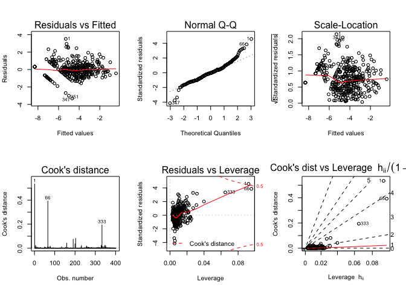
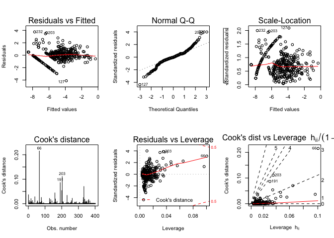
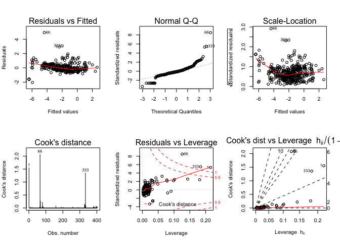
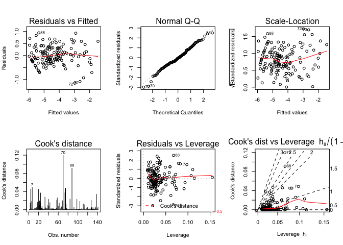

<!-- README.md is generated from README.Rmd. Please edit that file -->

# Interesting question

The goal of this project is to study the environmental impact of a
certain amount of production with Economic Input-Output Life Cycle
Assessment (EIO-LCA) method, which estimates activities in our economy
in the materials and energy resources required for and the environmental
impact resulting from. The environmental impacts involove conventional
air poluten (CAP), greenhouse gass (GHG), and toix release (TOX).
Cradle-to-grave is the full Life Cycle Assessment from resource
extraction to use phase and disposal phase. Specificallym, this analysis
is base on the Cradle-to-grave EIO-LCA result to further understand how
all industrial stages of producing Million Dollars product *in Dog and
Cat Food Manufacturing* (code 311111 in NAICS 2002) are different in
environmental impact. The study aim to answer the following questions:

  - which industry(s) have larger impact among all industries?
  - what are the relationship between some impact relative to the input
    (ie. Energy, water withdraw)?

## Hightlight

1.  for dog and cat food Manufacturing, the greatest environmental
    impacts come frome any raw material production industries such as
    agricultural farming.

2.  we successfully fit linear regression model on the following
    environmental impact using energy and water withdraw as input:

<!-- end list -->

  - Emissions of Nitrogen Oxides to Air,
  - Emissions of Sulfur Dioxide to Air,
  - weighting of greenhouse gas emissions into the air from the
    production,
  - Emissions of Carbon Dioxide (CO2) into the air from fossil fuel
    combus.

## Workflow

<center>


</center>

# Data description

What kind of data is avialble? How is your data collected? Are there any
concerns about the data? Which data is the most relevant? Is the data
easy to acccess? Will the data change over time? What needs to be done
to the data to get it ready for any downstream analysis?

The dataset for this project is the first pass life cycle assessment
results for cat and dog food manufacturing. It provides the
environmental impact information into the pet food supply chain. The LCA
data was generated through EIO-LCA
website(<http://www.eiolca.net/cgi-bin/dft/use.pl>). The model for
getting the LCA data is US 2002 producer price benchmark.

# Explore the data

After webscaping, combinding the raw data, and manually making minor
modification, we result a datafarme stored as ’dat\_311111\_1M\_v2.csv.

``` r
# data input
dat <- read.csv("data/dat_311111_1M_v2.csv")

# Input columns 
X <- dat %>% 
  select(Coal.TJ, NatGase.TJ, Petrol.TJ, Bio.Waste.TJ, NonFossElec.TJ, Water.Withdrawals.Kgal)
psych::describe(X)
#>                        vars   n   mean      sd median trimmed  mad min
#> Coal.TJ                   1 402   0.01    0.12   0.00    0.00 0.00   0
#> NatGase.TJ                2 402   0.01    0.08   0.00    0.00 0.00   0
#> Petrol.TJ                 3 402   0.01    0.07   0.00    0.00 0.00   0
#> Bio.Waste.TJ              4 402   0.00    0.01   0.00    0.00 0.00   0
#> NonFossElec.TJ            5 402   0.00    0.03   0.00    0.00 0.00   0
#> Water.Withdrawals.Kgal    6 402 446.14 7894.36   0.04    0.53 0.06   0
#>                              max     range  skew kurtosis     se
#> Coal.TJ                     2.32      2.32 19.34   379.42   0.01
#> NatGase.TJ                  1.37      1.37 13.88   217.66   0.00
#> Petrol.TJ                   1.09      1.09 13.11   195.82   0.00
#> Bio.Waste.TJ                0.18      0.18 10.27   114.44   0.00
#> NonFossElec.TJ              0.42      0.42 13.11   200.38   0.00
#> Water.Withdrawals.Kgal 158030.55 158030.55 19.79   391.97 393.73
```

``` r
M <- cor(X)
corrplot::corrplot(M, method="color")
```


``` r
# target columns 
CPA <- dat %>% select(CO.t, NH3.t, NOx.t, PM10.t, PM2.5.t, SO2.t, VOC.t)
GHG <- dat %>% select(Total.t.CO2e, CO2.Fossil.t.CO2e, CO2.Process.t.CO2e, CH4.t.CO2e, HFC.PFCs.t.CO2e)
TOX <- dat %>% select(Fugitive.kg, Stack.kg, Total.Air.kg, Surface.water.kg, U_ground.Water.kg, Land.kg, Offiste.kg, POTW.Metal.kg)
ys <- cbind(CPA, GHG, TOX)
psych::describe(ys)
#>                    vars   n mean    sd median trimmed  mad min    max
#> CO.t                  1 402 0.02  0.30   0.00    0.00 0.00   0   5.89
#> NH3.t                 2 402 0.01  0.14   0.00    0.00 0.00   0   2.69
#> NOx.t                 3 402 0.01  0.05   0.00    0.00 0.00   0   0.71
#> PM10.t                4 402 0.02  0.29   0.00    0.00 0.00   0   5.70
#> PM2.5.t               5 402 0.00  0.07   0.00    0.00 0.00   0   1.38
#> SO2.t                 6 402 0.01  0.06   0.00    0.00 0.00   0   1.08
#> VOC.t                 7 402 0.00  0.04   0.00    0.00 0.00   0   0.72
#> Total.t.CO2e          8 402 3.82 30.77   0.02    0.12 0.03   0 512.17
#> CO2.Fossil.t.CO2e     9 402 1.83 14.41   0.02    0.09 0.02   0 257.56
#> CO2.Process.t.CO2e   10 402 0.12  1.30   0.00    0.00 0.00   0  18.93
#> CH4.t.CO2e           11 402 0.55  5.90   0.00    0.00 0.00   0 108.46
#> HFC.PFCs.t.CO2e      12 402 0.02  0.25   0.00    0.00 0.00   0   4.16
#> Fugitive.kg          13 402 0.12  0.92   0.00    0.00 0.00   0  12.19
#> Stack.kg             14 402 0.42  2.73   0.00    0.01 0.00   0  33.32
#> Total.Air.kg         15 402 0.54  3.45   0.00    0.01 0.00   0  37.09
#> Surface.water.kg     16 402 0.13  1.06   0.00    0.00 0.00   0  16.40
#> U_ground.Water.kg    17 402 0.06  0.56   0.00    0.00 0.00   0   8.84
#> Land.kg              18 402 0.30  3.28   0.00    0.00 0.00   0  59.73
#> Offiste.kg           19 402 0.12  0.99   0.00    0.00 0.00   0  18.39
#> POTW.Metal.kg        20 402 0.00  0.00   0.00    0.00 0.00   0   0.04
#>                     range  skew kurtosis   se
#> CO.t                 5.89 19.52   384.80 0.01
#> NH3.t                2.69 18.08   341.44 0.01
#> NOx.t                0.71  9.98   106.60 0.00
#> PM10.t               5.70 19.67   388.60 0.01
#> PM2.5.t              1.38 19.45   382.60 0.00
#> SO2.t                1.08 17.91   339.19 0.00
#> VOC.t                0.72 15.18   251.89 0.00
#> Total.t.CO2e       512.17 13.30   198.04 1.53
#> CO2.Fossil.t.CO2e  257.56 14.83   248.47 0.72
#> CO2.Process.t.CO2e  18.93 12.41   160.89 0.06
#> CH4.t.CO2e         108.46 15.92   278.75 0.29
#> HFC.PFCs.t.CO2e      4.16 13.62   201.15 0.01
#> Fugitive.kg         12.19 11.03   130.44 0.05
#> Stack.kg            33.32  8.71    82.72 0.14
#> Total.Air.kg        37.09  8.38    73.86 0.17
#> Surface.water.kg    16.40 12.74   175.01 0.05
#> U_ground.Water.kg    8.84 12.13   164.86 0.03
#> Land.kg             59.73 15.78   271.04 0.16
#> Offiste.kg          18.39 16.01   285.76 0.05
#> POTW.Metal.kg        0.04  7.48    61.88 0.00
```

# Fit Models

## user-define function

``` r
# test: target_nm = "CO.t"
makedata_map <- function(target_nm, dat){
  # Input columns
  Xy = dat %>%
    select(Coal.TJ, NatGase.TJ, Petrol.TJ, 
           Bio.Waste.TJ, NonFossElec.TJ, 
           Water.Withdrawals.Kgal,
           target_nm)
  
  Xy <- cbind(dat %>% select(Sector) %>% mutate(Sector= Sector %>% as.factor()), 
              log10(Xy + min(Xy[Xy!=0])/100)) 
  colnames(Xy) <- colnames(Xy) %>% stringr::str_replace_all("\\.","") 
  return(Xy)
}

bind_coef_star <- function(x) {
  if (stringr::str_detect(x[2] , "\\*")) {
    paste0(x[1], "(",x[2], ")")
  } else if (!is.na(x[1])){
    paste0(x[1])
  } else{
    ""
  }
}
```

## Linear Regression Modeling with log10 Transformation on Input and Output

``` r
# create a dataframe with a column with impact variable names 
target_list <- tibble(target = c(colnames(CPA),colnames(GHG),colnames(TOX))); target_list
#> # A tibble: 20 x 1
#>    target            
#>    <chr>             
#>  1 CO.t              
#>  2 NH3.t             
#>  3 NOx.t             
#>  4 PM10.t            
#>  5 PM2.5.t           
#>  6 SO2.t             
#>  7 VOC.t             
#>  8 Total.t.CO2e      
#>  9 CO2.Fossil.t.CO2e 
#> 10 CO2.Process.t.CO2e
#> 11 CH4.t.CO2e        
#> 12 HFC.PFCs.t.CO2e   
#> 13 Fugitive.kg       
#> 14 Stack.kg          
#> 15 Total.Air.kg      
#> 16 Surface.water.kg  
#> 17 U_ground.Water.kg 
#> 18 Land.kg           
#> 19 Offiste.kg        
#> 20 POTW.Metal.kg

# model selection for each impact variable
bestglm_list <- target_list %>% 
  mutate(data = target %>% 
           map(function(target_nm) makedata_map(target_nm,
                                                dat= dat))) %>% 
  mutate(rowdata = data %>% map_dbl(nrow)) %>% 
  filter(rowdata > 100) %>% 
  select(-rowdata) %>% 
  mutate(top_model = data %>% 
           map(function(data) bestglm::bestglm(Xy=data %>% select_if(is.numeric), family = gaussian, method = "exhaustive", IC = "BIC", TopModels = 1))) %>% 
  mutate(best_model = top_model %>% map(function(top_model) top_model[[1]])) %>% 
  mutate(anv = best_model %>% map(anova)) %>% 
  mutate(statisics = best_model %>% purrr::map(.f = function(m) broom::glance(m))) %>% 
  tidyr::unnest(statisics)

# extract coefficient from the best model of each impact variable
coef_list <- bestglm_list %>% 
  mutate(coefs = best_model %>% purrr::map(.f=broom::tidy)) %>% 
  select(target, coefs) %>% 
  tidyr::unnest(coefs) %>% 
  select(target, term, estimate) %>% 
  tidyr::spread(key= term, value = estimate)

# extract p-value for each paramters of the best model of each impact variable
signif_list <- bestglm_list %>% 
  mutate(coefs = best_model %>% purrr::map(.f=broom::tidy)) %>% 
  select(target, coefs) %>% 
  tidyr::unnest(coefs) %>% 
  select(target, term, p.value) %>% 
  tidyr::spread(key= term, value = p.value)

# combind coefficient and p-value to result in a tidy table of the result
datArray <- abind::abind(coef_list %>% 
                           select(-target) %>% 
                           mutate_if(is.numeric, signif, digits = 3) %>% 
                           mutate_all(as.character),
                         signif_list %>% 
                           select(-target) %>% 
                           mutate_if(is.numeric, gtools::stars.pval),along=3)
coef_signif_list <- bestglm_list %>% 
  select(target, r.squared, adj.r.squared, p.value) %>% 
  cbind(apply(datArray,1:2, bind_coef_star) %>% as_tibble())

# result
knitr::kable(coef_signif_list)
```

<table>

<thead>

<tr>

<th style="text-align:left;">

target

</th>

<th style="text-align:right;">

r.squared

</th>

<th style="text-align:right;">

adj.r.squared

</th>

<th style="text-align:right;">

p.value

</th>

<th style="text-align:left;">

(Intercept)

</th>

<th style="text-align:left;">

BioWasteTJ

</th>

<th style="text-align:left;">

CoalTJ

</th>

<th style="text-align:left;">

NatGaseTJ

</th>

<th style="text-align:left;">

NonFossElecTJ

</th>

<th style="text-align:left;">

PetrolTJ

</th>

<th style="text-align:left;">

WaterWithdrawalsKgal

</th>

</tr>

</thead>

<tbody>

<tr>

<td style="text-align:left;">

CO.t

</td>

<td style="text-align:right;">

0.7330828

</td>

<td style="text-align:right;">

0.7310708

</td>

<td style="text-align:right;">

0.00e+00

</td>

<td style="text-align:left;">

\-7.12(\*\*\*)

</td>

<td style="text-align:left;">

\-0.177(\*\*\*)

</td>

<td style="text-align:left;">

\-0.175(\*\*\*)

</td>

<td style="text-align:left;">

0.478(\*\*\*)

</td>

<td style="text-align:left;">

</td>

<td style="text-align:left;">

0.21(\*\*\*)

</td>

<td style="text-align:left;">

\-0.174(\*\*)

</td>

</tr>

<tr>

<td style="text-align:left;">

NH3.t

</td>

<td style="text-align:right;">

0.5551474

</td>

<td style="text-align:right;">

0.5517942

</td>

<td style="text-align:right;">

0.00e+00

</td>

<td style="text-align:left;">

0.55(\*\*)

</td>

<td style="text-align:left;">

0.125(\*\*\*)

</td>

<td style="text-align:left;">

</td>

<td style="text-align:left;">

</td>

<td style="text-align:left;">

0.517(\*\*\*)

</td>

<td style="text-align:left;">

0.461(\*\*\*)

</td>

<td style="text-align:left;">

</td>

</tr>

<tr>

<td style="text-align:left;">

NOx.t

</td>

<td style="text-align:right;">

0.8127220

</td>

<td style="text-align:right;">

0.8113103

</td>

<td style="text-align:right;">

0.00e+00

</td>

<td style="text-align:left;">

2.19(\*\*\*)

</td>

<td style="text-align:left;">

</td>

<td style="text-align:left;">

</td>

<td style="text-align:left;">

0.119(\*\*\*)

</td>

<td style="text-align:left;">

0.512(\*\*\*)

</td>

<td style="text-align:left;">

0.292(\*\*\*)

</td>

<td style="text-align:left;">

0.142(\*\*\*)

</td>

</tr>

<tr>

<td style="text-align:left;">

PM10.t

</td>

<td style="text-align:right;">

0.6976157

</td>

<td style="text-align:right;">

0.6953364

</td>

<td style="text-align:right;">

0.00e+00

</td>

<td style="text-align:left;">

\-7.01(\*\*\*)

</td>

<td style="text-align:left;">

</td>

<td style="text-align:left;">

</td>

<td style="text-align:left;">

0.187(\*\*\*)

</td>

<td style="text-align:left;">

</td>

<td style="text-align:left;">

</td>

<td style="text-align:left;">

</td>

</tr>

<tr>

<td style="text-align:left;">

PM2.5.t

</td>

<td style="text-align:right;">

0.6639711

</td>

<td style="text-align:right;">

0.6614382

</td>

<td style="text-align:right;">

0.00e+00

</td>

<td style="text-align:left;">

1.74(\*\*\*)

</td>

<td style="text-align:left;">

0.767(\*\*\*)

</td>

<td style="text-align:left;">

0.227(\*\*\*)

</td>

<td style="text-align:left;">

</td>

<td style="text-align:left;">

0.531(\*\*\*)

</td>

<td style="text-align:left;">

\-0.41(\*\*\*)

</td>

<td style="text-align:left;">

</td>

</tr>

<tr>

<td style="text-align:left;">

SO2.t

</td>

<td style="text-align:right;">

0.7853989

</td>

<td style="text-align:right;">

0.7832367

</td>

<td style="text-align:right;">

0.00e+00

</td>

<td style="text-align:left;">

\-7.59(\*\*\*)

</td>

<td style="text-align:left;">

</td>

<td style="text-align:left;">

</td>

<td style="text-align:left;">

</td>

<td style="text-align:left;">

0.187(\*\*\*)

</td>

<td style="text-align:left;">

\-0.0906(\*\*)

</td>

<td style="text-align:left;">

</td>

</tr>

<tr>

<td style="text-align:left;">

VOC.t

</td>

<td style="text-align:right;">

0.5833390

</td>

<td style="text-align:right;">

0.5801984

</td>

<td style="text-align:right;">

0.00e+00

</td>

<td style="text-align:left;">

0.276

</td>

<td style="text-align:left;">

0.58(\*\*\*)

</td>

<td style="text-align:left;">

0.229(\*\*\*)

</td>

<td style="text-align:left;">

0.281(\*\*\*)

</td>

<td style="text-align:left;">

</td>

<td style="text-align:left;">

</td>

<td style="text-align:left;">

</td>

</tr>

<tr>

<td style="text-align:left;">

Total.t.CO2e

</td>

<td style="text-align:right;">

0.8864414

</td>

<td style="text-align:right;">

0.8852972

</td>

<td style="text-align:right;">

0.00e+00

</td>

<td style="text-align:left;">

\-1.9(\*\*\*)

</td>

<td style="text-align:left;">

0.2(\*\*\*)

</td>

<td style="text-align:left;">

</td>

<td style="text-align:left;">

</td>

<td style="text-align:left;">

0.317(\*\*\*)

</td>

<td style="text-align:left;">

0.399(\*\*\*)

</td>

<td style="text-align:left;">

</td>

</tr>

<tr>

<td style="text-align:left;">

CO2.Fossil.t.CO2e

</td>

<td style="text-align:right;">

0.8897299

</td>

<td style="text-align:right;">

0.8886189

</td>

<td style="text-align:right;">

0.00e+00

</td>

<td style="text-align:left;">

0.402(\*\*)

</td>

<td style="text-align:left;">

0.132(\*\*\*)

</td>

<td style="text-align:left;">

</td>

<td style="text-align:left;">

</td>

<td style="text-align:left;">

0.496(\*\*\*)

</td>

<td style="text-align:left;">

0.462(\*\*\*)

</td>

<td style="text-align:left;">

</td>

</tr>

<tr>

<td style="text-align:left;">

CO2.Process.t.CO2e

</td>

<td style="text-align:right;">

0.0554757

</td>

<td style="text-align:right;">

0.0531144

</td>

<td style="text-align:right;">

1.80e-06

</td>

<td style="text-align:left;">

0.56

</td>

<td style="text-align:left;">

0.69(\*\*\*)

</td>

<td style="text-align:left;">

</td>

<td style="text-align:left;">

0.544(\*\*\*)

</td>

<td style="text-align:left;">

</td>

<td style="text-align:left;">

\-0.246(\*\*\*)

</td>

<td style="text-align:left;">

</td>

</tr>

<tr>

<td style="text-align:left;">

CH4.t.CO2e

</td>

<td style="text-align:right;">

0.1769380

</td>

<td style="text-align:right;">

0.1665458

</td>

<td style="text-align:right;">

0.00e+00

</td>

<td style="text-align:left;">

0.0321

</td>

<td style="text-align:left;">

0.208(\*\*\*)

</td>

<td style="text-align:left;">

</td>

<td style="text-align:left;">

</td>

<td style="text-align:left;">

0.295(\*\*\*)

</td>

<td style="text-align:left;">

0.584(\*\*\*)

</td>

<td style="text-align:left;">

</td>

</tr>

<tr>

<td style="text-align:left;">

HFC.PFCs.t.CO2e

</td>

<td style="text-align:right;">

0.0454860

</td>

<td style="text-align:right;">

0.0407015

</td>

<td style="text-align:right;">

9.26e-05

</td>

<td style="text-align:left;">

\-0.338

</td>

<td style="text-align:left;">

0.248(\*\*\*)

</td>

<td style="text-align:left;">

</td>

<td style="text-align:left;">

</td>

<td style="text-align:left;">

0.265(\*\*\*)

</td>

<td style="text-align:left;">

0.545(\*\*\*)

</td>

<td style="text-align:left;">

</td>

</tr>

<tr>

<td style="text-align:left;">

Fugitive.kg

</td>

<td style="text-align:right;">

0.5721880

</td>

<td style="text-align:right;">

0.5678776

</td>

<td style="text-align:right;">

0.00e+00

</td>

<td style="text-align:left;">

\-2.39(\*\*\*)

</td>

<td style="text-align:left;">

0.414(\*\*\*)

</td>

<td style="text-align:left;">

0.177(\*\*)

</td>

<td style="text-align:left;">

</td>

<td style="text-align:left;">

0.406(\*\*\*)

</td>

<td style="text-align:left;">

\-0.261(\*\*\*)

</td>

<td style="text-align:left;">

</td>

</tr>

<tr>

<td style="text-align:left;">

Stack.kg

</td>

<td style="text-align:right;">

0.5595776

</td>

<td style="text-align:right;">

0.5551401

</td>

<td style="text-align:right;">

0.00e+00

</td>

<td style="text-align:left;">

0.745(\*\*\*)

</td>

<td style="text-align:left;">

0.162(\*\*\*)

</td>

<td style="text-align:left;">

0.18(\*\*\*)

</td>

<td style="text-align:left;">

</td>

<td style="text-align:left;">

0.278(\*\*\*)

</td>

<td style="text-align:left;">

0.536(\*\*\*)

</td>

<td style="text-align:left;">

</td>

</tr>

<tr>

<td style="text-align:left;">

Total.Air.kg

</td>

<td style="text-align:right;">

0.5735031

</td>

<td style="text-align:right;">

0.5692059

</td>

<td style="text-align:right;">

0.00e+00

</td>

<td style="text-align:left;">

1.92(\*\*\*)

</td>

<td style="text-align:left;">

0.828(\*\*\*)

</td>

<td style="text-align:left;">

0.169(\*\*)

</td>

<td style="text-align:left;">

0.393(\*\*\*)

</td>

<td style="text-align:left;">

</td>

<td style="text-align:left;">

\-0.325(\*\*\*)

</td>

<td style="text-align:left;">

</td>

</tr>

<tr>

<td style="text-align:left;">

Surface.water.kg

</td>

<td style="text-align:right;">

0.4861662

</td>

<td style="text-align:right;">

0.4822931

</td>

<td style="text-align:right;">

0.00e+00

</td>

<td style="text-align:left;">

0.42

</td>

<td style="text-align:left;">

0.641(\*\*\*)

</td>

<td style="text-align:left;">

0.239(\*\*\*)

</td>

<td style="text-align:left;">

</td>

<td style="text-align:left;">

0.269(\*\*\*)

</td>

<td style="text-align:left;">

</td>

<td style="text-align:left;">

</td>

</tr>

<tr>

<td style="text-align:left;">

U\_ground.Water.kg

</td>

<td style="text-align:right;">

0.1408868

</td>

<td style="text-align:right;">

0.1365805

</td>

<td style="text-align:right;">

0.00e+00

</td>

<td style="text-align:left;">

2.65(\*\*\*)

</td>

<td style="text-align:left;">

0.832(\*\*\*)

</td>

<td style="text-align:left;">

0.262(\*\*\*)

</td>

<td style="text-align:left;">

</td>

<td style="text-align:left;">

0.527(\*\*\*)

</td>

<td style="text-align:left;">

\-0.454(\*\*\*)

</td>

<td style="text-align:left;">

</td>

</tr>

<tr>

<td style="text-align:left;">

Land.kg

</td>

<td style="text-align:right;">

0.4512091

</td>

<td style="text-align:right;">

0.4470725

</td>

<td style="text-align:right;">

0.00e+00

</td>

<td style="text-align:left;">

2.4(\*\*\*)

</td>

<td style="text-align:left;">

</td>

<td style="text-align:left;">

</td>

<td style="text-align:left;">

0.122(\*\*\*)

</td>

<td style="text-align:left;">

0.542(\*\*\*)

</td>

<td style="text-align:left;">

0.302(\*\*\*)

</td>

<td style="text-align:left;">

0.135(\*\*\*)

</td>

</tr>

<tr>

<td style="text-align:left;">

Offiste.kg

</td>

<td style="text-align:right;">

0.4594006

</td>

<td style="text-align:right;">

0.4553257

</td>

<td style="text-align:right;">

0.00e+00

</td>

<td style="text-align:left;">

\-5.18(\*\*\*)

</td>

<td style="text-align:left;">

0.248(\*\*\*)

</td>

<td style="text-align:left;">

</td>

<td style="text-align:left;">

</td>

<td style="text-align:left;">

</td>

<td style="text-align:left;">

0.172(\*\*\*)

</td>

<td style="text-align:left;">

</td>

</tr>

<tr>

<td style="text-align:left;">

POTW.Metal.kg

</td>

<td style="text-align:right;">

0.3692912

</td>

<td style="text-align:right;">

0.3629365

</td>

<td style="text-align:right;">

0.00e+00

</td>

<td style="text-align:left;">

\-0.255

</td>

<td style="text-align:left;">

0.198(\*\*\*)

</td>

<td style="text-align:left;">

</td>

<td style="text-align:left;">

</td>

<td style="text-align:left;">

0.524(\*\*\*)

</td>

<td style="text-align:left;">

0.251(\*\*\*)

</td>

<td style="text-align:left;">

</td>

</tr>

</tbody>

</table>

# Communciate and visualize the results

## The diagnosis of linear model

``` r
good_lm <- bestglm_list %>% filter(adj.r.squared >0.75); good_lm
#> # A tibble: 4 x 16
#>   target data  top_model best_model anv   r.squared adj.r.squared sigma
#>   <chr>  <lis> <list>    <list>     <lis>     <dbl>         <dbl> <dbl>
#> 1 NOx.t  <df[… <bestglm> <lm>       <df[…     0.813         0.811 0.803
#> 2 SO2.t  <df[… <bestglm> <lm>       <df[…     0.785         0.783 0.944
#> 3 Total… <df[… <bestglm> <lm>       <df[…     0.886         0.885 0.620
#> 4 CO2.F… <df[… <bestglm> <lm>       <df[…     0.890         0.889 0.592
#> # … with 8 more variables: statistic <dbl>, p.value <dbl>, df <int>,
#> #   logLik <dbl>, AIC <dbl>, BIC <dbl>, deviance <dbl>, df.residual <int>
par(mfrow=c(2,3))
plot(good_lm$best_model[[1]], which=1:6)
```



``` r
plot(good_lm$best_model[[2]], which=1:6)
```



``` r
plot(good_lm$best_model[[3]], which=1:6)
```



``` r
plot(good_lm$best_model[[4]], which=1:6)
```



# Result

## Impact between Sector

``` r
# descriptive analysis
good_lm$target
#> [1] "NOx.t"             "SO2.t"             "Total.t.CO2e"     
#> [4] "CO2.Fossil.t.CO2e"
# NOx.t: Emissions of Nitrogen Oxides to Air from each sector. t = meric tons
# SO2.t: Emissions of Sulfur Dioxide to Air from each sector. t = meric tons 
# Total.t.CO2e: Global Warming Potential (GWP) is a weighting of greenhouse gas emissions into the air from the production of each sector. Weighting factors are 100-year GWP values from the IPCC Second Assessment Report (IPCC 2001). t CO2e = metric tons of CO2 equivalent emissions. 
# CO2.Fossil.t.CO2e C: Emissions of Carbon Dioxide (CO2) into the air from each sector from fossil fuel combustion sources. t CO2e = metric tons of CO2 equivalent.

par(mfrow=c(1,2))
plot(good_lm$data[[1]][,ncol(good_lm$data[[1]])])
plot(good_lm$data[[1]][,1], good_lm$data[[1]][,ncol(good_lm$data[[1]])])
```


``` r

plot(good_lm$data[[2]][,ncol(good_lm$data[[2]])])
plot(good_lm$data[[2]][,1], good_lm$data[[2]][,ncol(good_lm$data[[2]])])
```


``` r

plot(good_lm$data[[3]][,ncol(good_lm$data[[3]])])
plot(good_lm$data[[3]][,1], good_lm$data[[3]][,ncol(good_lm$data[[3]])])
```


``` r

plot(good_lm$data[[4]][,ncol(good_lm$data[[4]])])
plot(good_lm$data[[4]][,1], good_lm$data[[4]][,ncol(good_lm$data[[4]])])
```


