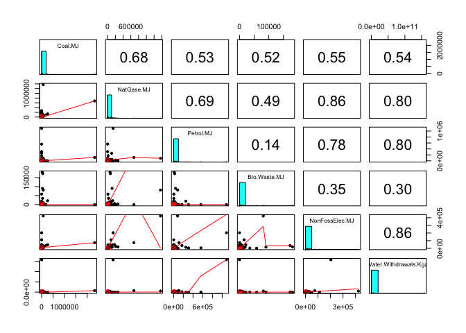
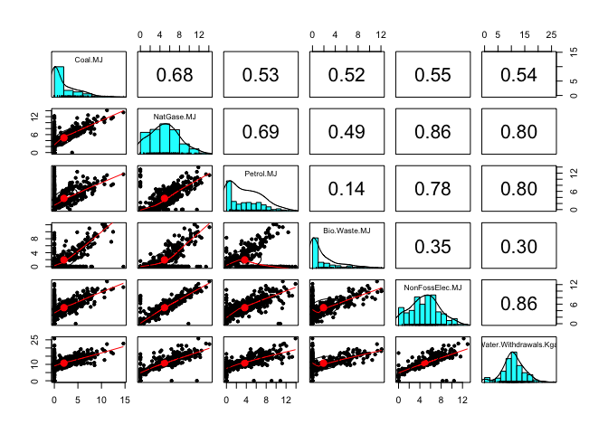
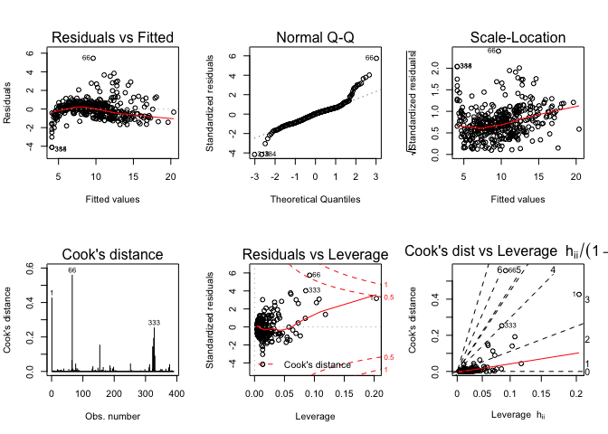
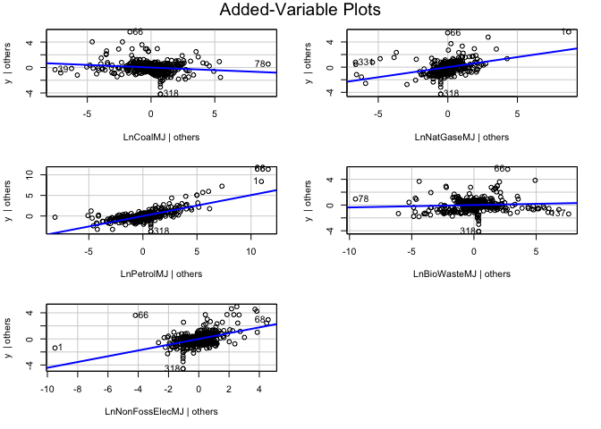
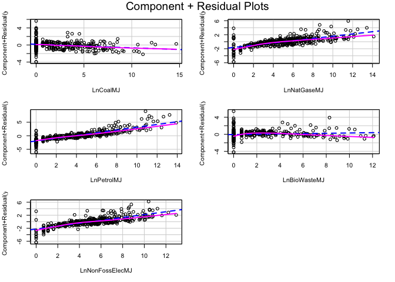
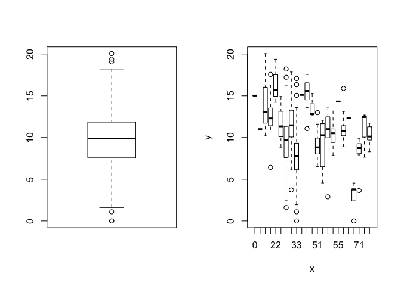
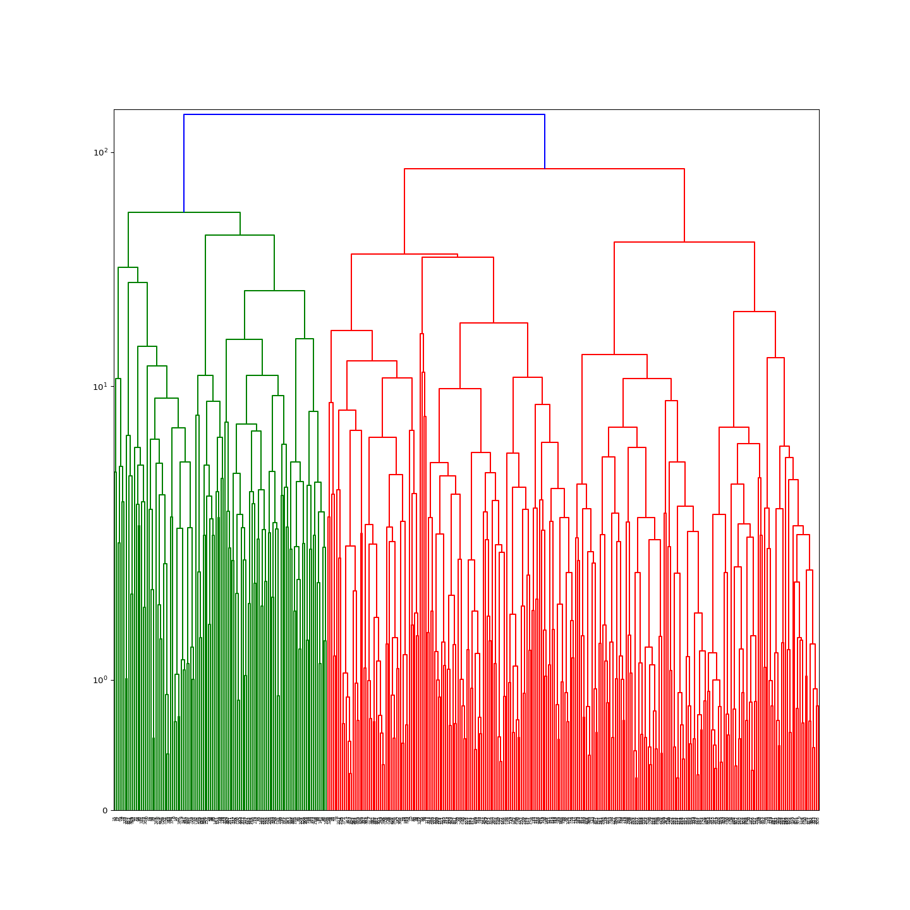
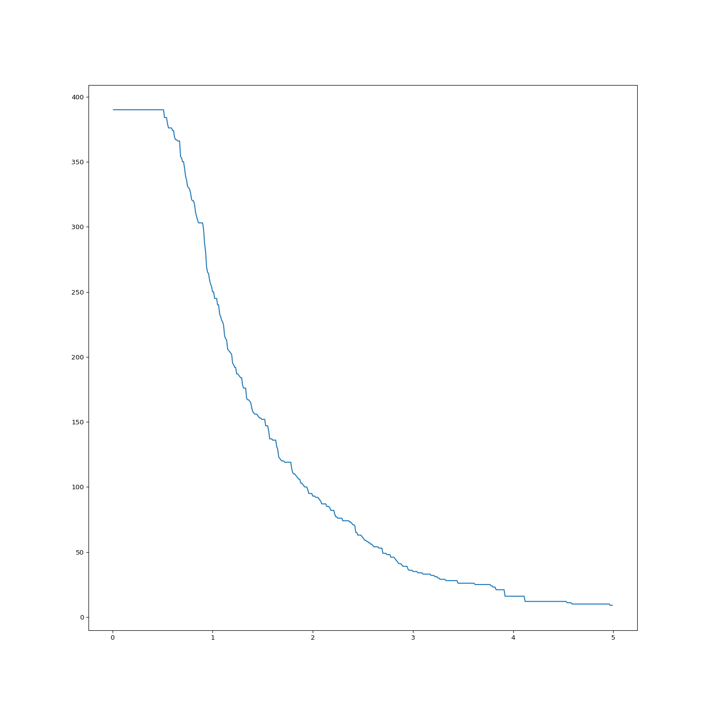
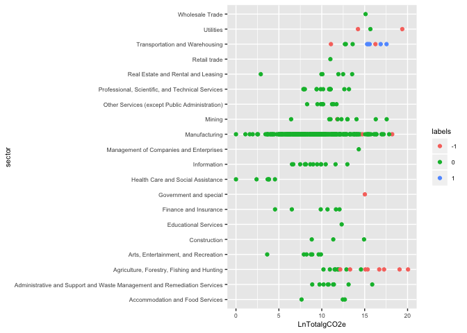

EIO-LCA Analysis: Pet Food Supply Chain
================
Weiquan Luo, Mingjun Ma
2019-12-11

  - [Background information](#background-information)
  - [Interesting question](#interesting-question)
  - [Hightlight of result](#hightlight-of-result)
  - [Data description](#data-description)
  - [Workflow](#workflow)
  - [Explore the data](#explore-the-data)
      - [Correlation](#correlation)
  - [Regression](#regression)
      - [User-defined Functions](#user-defined-functions)
      - [LogLog Linear Regression](#loglog-linear-regression)
      - [Diagnosis for GHG CO2 Equvivalent
        model:](#diagnosis-for-ghg-co2-equvivalent-model)
          - [Added-variable plots](#added-variable-plots)
          - [Partial-residual plots](#partial-residual-plots)
      - [Random effect: Impact among
        sectors](#random-effect-impact-among-sectors)
      - [Interaction effect](#interaction-effect)
  - [Clustering for CO2 Equvivalent](#clustering-for-co2-equvivalent)
      - [Dendrogram](#dendrogram)
      - [DBSCAN](#dbscan)
      - [Visualize clusters](#visualize-clusters)
  - [Discussion](#discussion)
  - [Final Note](#final-note)
  - [Exercise](#exercise)

<!-- README.md is generated from README.Rmd. Please edit that file -->

# Background information

According to the APPA (American Pet Product Association) 2019-2020 pet
owner survey, around 84.9 million U.S. households own pet, which is
about 67% of the U.S. homes (APPA, 2019). In 2018, the U.S. customer
spent 72.56 billion dollars on their pets, of which 30.32 billion
dollars is for pet food. From a 2017 U.S. pet owners survey, 2% of dog
and cat owners select their pet food based on product claim of
sustainable or eco-friendly pet food formula. Although the percentage is
low, the interest in the sustainability of the pet food has grown a lot
recently.

# Interesting question

The goal of this project is to study the environmental impact of a
certain amount of production with Economic Input-Output Life Cycle
Assessment (EIO-LCA) method, which estimates activities in our economy
in the materials and energy resources required for and the environmental
impact resulting from. The environmental impacts involve conventional
air poluten (CAP), greenhouse gass (GHG), and toix release (TOX).
Cradle-to-grave is the full Life Cycle Assessment from resource
extraction to use phase and disposal phase. Specificallym, this analysis
is base on the Cradle-to-grave EIO-LCA result to further understand how
all industrial stages of producing Million Dollars product *in Dog and
Cat Food Manufacturing* (code 311111 in NAICS 2002) are different in
environmental impact. The study aim to answer the following questions:

1.  as the pet food economic growth, how does increase in production
    inflence the environmental impacts, by assuming input of resource
    and output of production are proportional.
2.  Is there any industry(s) has extraordinary environmental impact
    compared to other?

# Hightlight of result

  - on average, by increasing pet food production by 1%, most
    environmental impacts increase by more than 1%, but toxic increase
    by less than 1%
  - in pet food manufacturing, the greatest environmental impacts come
    from agricultural farming sector, and the utility sector of Electric
    Power Generation, Transmission and Distribution.
  - the industries using biowaste energy have higher impact in toxic.

# Data description

The dataset for this project is the first pass life cycle assessment
results for cat and dog food manufacturing. It provides the
environmental impact information into the pet food supply chain. The LCA
data was generated through EIO-LCA
website(<http://www.eiolca.net/cgi-bin/dft/use.pl>). The model for
getting the LCA data is US 2002 producer price benchmark. In order to
get the dog and cat food manufacturing LCA data, the user needs to
select “Food beverage and tobacco” sector group, dog and cat food
manufacturing sector and then the amount of economic activity for this
sector(e.g. 1 millon dollars). After setting up the sector and economic
parameters, The user could select different economical and environmental
impact to get the LCA results. The LCA results are ready for downloading
as excel files. The raw data was lacking the columns name for different
impact feature and index for identifying the different sectors and
sector group. The web scraping is necessary for the columns name and
NAICS sector code.

# Workflow

<center>


</center>

# Explore the data

After webscaping, combinding the raw data, and manually making minor
modification, we result a datafarme stored as ’dat\_311111\_1M\_v2.csv.

``` r
# data input
dat <- read.csv("data/dat_311111_1M_v2.csv")
dim(dat)
#> [1] 402  41
```

``` r
# calculate and rename
calculate_formula_replace_nm <- function(data, formula = y~1000*x, pattern= pattern, replacement= replacement){
  
  calculate_formula<- function(data, formula = formula){
    as.function <- function(formula) {
      cmd <- tail(as.character(formula),1)
      exp <- parse(text=cmd)
      function(...) eval(exp, list(...))
    }
    formula.function <- as.function(formula)
    result<- formula.function(x=data)
    return(result)
  }
  data <- data %>% dplyr::mutate_all(calculate_formula, formula = formula) %>% 
    stats::setNames(stringr::str_replace_all(names(.), pattern= pattern, replacement= replacement )) 
  return(data)
}
# piping: Sort environment impact group and input resouce, unit convertion to result no 0<.<1, rename by unit
CPA <- dat %>% select(CO.t, NH3.t, NOx.t, PM10.t, PM2.5.t, SO2.t, VOC.t) %>% 
  calculate_formula_replace_nm(formula = y~x*10^6, pattern= "\\.t", replacement= ".g")
GHG <- dat %>% select(Total.t.CO2e, CO2.Fossil.t.CO2e, CO2.Process.t.CO2e, CH4.t.CO2e, HFC.PFCs.t.CO2e) %>% 
  calculate_formula_replace_nm(formula = y~x*10^6, pattern= "\\.t", replacement= ".g")
TOX <- dat %>% select(Fugitive.kg, Stack.kg, Total.Air.kg, Surface.water.kg, U_ground.Water.kg, Land.kg, Offiste.kg, POTW.Metal.kg) %>% 
  calculate_formula_replace_nm(formula = y~x*10^6, pattern= "\\.kg", replacement= ".mg")
resource <- dat %>% select(Coal.TJ, NatGase.TJ, Petrol.TJ,Bio.Waste.TJ, NonFossElec.TJ, Water.Withdrawals.Kgal) %>% 
  calculate_formula_replace_nm(formula = y~x*10^6, pattern= "\\.TJ", replacement= ".MJ")
ID <- dat %>% select(Sector, Description, name_sub, Sector_sub) %>% mutate_all(as.factor)
dat <- cbind(ID, CPA, GHG, TOX, resource)

# summary statistic for X variable
ys <- cbind(CPA, GHG, TOX)
psych::describe(ys) %>% knitr::kable(format = "markdown") 
```

|                    | vars |   n |         mean |           sd |  median |      trimmed |        mad | min |       max |     range |      skew |  kurtosis |           se |
| :----------------- | ---: | --: | -----------: | -----------: | ------: | -----------: | ---------: | --: | --------: | --------: | --------: | --------: | -----------: |
| CO.g               |    1 | 402 |   22214.7438 |   295207.762 |    38.5 | 6.645031e+02 |    57.0801 |   0 |   5888105 |   5888105 | 19.523839 | 384.79885 |   14723.6250 |
| NH3.g              |    2 | 402 |    9829.9876 |   138921.135 |     1.0 | 8.649068e+00 |     1.4826 |   0 |   2687352 |   2687352 | 18.084851 | 341.44049 |    6928.7564 |
| NOx.g              |    3 | 402 |    8035.9080 |    54044.815 |    28.0 | 3.363199e+02 |    41.5128 |   0 |    707607 |    707607 |  9.977676 | 106.60356 |    2695.5104 |
| PM10.g             |    4 | 402 |   17716.5000 |   285050.372 |     5.5 | 1.408199e+02 |     8.1543 |   0 |   5695606 |   5695606 | 19.666983 | 388.60310 |   14217.0204 |
| PM2.5.g            |    5 | 402 |    4723.6443 |    69454.677 |     4.0 | 7.199689e+01 |     5.9304 |   0 |   1382822 |   1382822 | 19.453251 | 382.59517 |    3464.0845 |
| SO2.g              |    6 | 402 |    5711.2488 |    55906.619 |    14.0 | 2.276739e+02 |    20.7564 |   0 |   1082028 |   1082028 | 17.908593 | 339.19226 |    2788.3687 |
| VOC.g              |    7 | 402 |    4737.9104 |    40628.764 |    22.5 | 2.172981e+02 |    33.3585 |   0 |    723802 |    723802 | 15.184308 | 251.89230 |    2026.3786 |
| Total.g.CO2e       |    8 | 402 | 3816211.4975 | 30772366.891 | 17144.5 | 1.191106e+05 | 25197.5283 |   0 | 512173950 | 512173950 | 13.299869 | 198.03556 | 1534786.1634 |
| CO2.Fossil.g.CO2e  |    9 | 402 | 1834585.9353 | 14412095.613 | 16962.5 | 9.019479e+04 | 24927.6951 |   0 | 257559803 | 257559803 | 14.832228 | 248.47182 |  718809.9963 |
| CO2.Process.g.CO2e |   10 | 402 |  124910.3731 |  1301289.377 |     0.0 | 0.000000e+00 |     0.0000 |   0 |  18929557 |  18929557 | 12.407185 | 160.89258 |   64902.4151 |
| CH4.g.CO2e         |   11 | 402 |  545257.2090 |  5900697.887 |     0.0 | 0.000000e+00 |     0.0000 |   0 | 108460987 | 108460987 | 15.916464 | 278.74807 |  294300.0616 |
| HFC.PFCs.g.CO2e    |   12 | 402 |   21954.0572 |   250994.325 |     0.0 | 0.000000e+00 |     0.0000 |   0 |   4161163 |   4161163 | 13.617934 | 201.14719 |   12518.4591 |
| Fugitive.mg        |   13 | 402 |  122187.4279 |   915621.053 |   156.0 | 3.679661e+03 |   231.2856 |   0 |  12189404 |  12189404 | 11.026986 | 130.43964 |   45667.0275 |
| Stack.mg           |   14 | 402 |  420683.3582 |  2733120.398 |   309.0 | 9.008301e+03 |   458.1234 |   0 |  33321666 |  33321666 |  8.712720 |  82.72182 |  136315.6557 |
| Total.Air.mg       |   15 | 402 |  542871.1891 |  3445903.489 |   567.5 | 1.356760e+04 |   841.3755 |   0 |  37092916 |  37092916 |  8.377980 |  73.86411 |  171866.0451 |
| Surface.water.mg   |   16 | 402 |  128163.1841 |  1064869.900 |     0.0 | 3.836894e+02 |     0.0000 |   0 |  16404607 |  16404607 | 12.738129 | 175.01346 |   53110.8833 |
| U\_ground.Water.mg |   17 | 402 |   64391.2164 |   563431.638 |     0.0 | 0.000000e+00 |     0.0000 |   0 |   8839104 |   8839104 | 12.131672 | 164.85908 |   28101.4159 |
| Land.mg            |   18 | 402 |  301267.4900 |  3280450.751 |     0.0 | 3.429286e+02 |     0.0000 |   0 |  59730055 |  59730055 | 15.784280 | 271.04069 |  163614.0125 |
| Offiste.mg         |   19 | 402 |  117607.6294 |   991341.570 |    88.5 | 2.997488e+03 |   131.2101 |   0 |  18394299 |  18394299 | 16.006124 | 285.75539 |   49443.6236 |
| POTW.Metal.mg      |   20 | 402 |     706.3532 |     3661.431 |     0.0 | 3.324224e+01 |     0.0000 |   0 |     40218 |     40218 |  7.481724 |  61.88361 |     182.6156 |

## Correlation

Observation from correlation plot

  - The scatter plots show most information are concentrate at the
    origin of the feature space, but sparse anywhere else
    (heteroskedastic);
  - The distribution plots show variables are highly skewed (not
    normally distributed);
  - The spearman correlations show that most independent variables are
    moderate correlative, but some are unlikly and some are likly
    correlative (multicollinearity).

<!-- end list -->

``` r
# raw X variable
psych::pairs.panels(resource, method = "spearman")
```



The data is suitable for log transformation and could be modelled in
LogLog transformation.

con

  - the interpretation of each parameter distorted from scalar to ratio
    of the scalar quantity (i.e. For regressions, the coefficent is
    interpret as the reletive change, in clusterings, the cluster is the
    group of similar magnitude).
  - it is not able to fix the issue of multicollinearity, so
    variable/model selection are required.

pro

  - the information at the origin can be stretched out.  
  - the resulting linear regression can be interpreted at elastisity
    (similar to the idea cobb-douglas utility function in Econometrics)

<!-- end list -->

``` r
# Ln X variable
psych::pairs.panels(log(resource+1), method = "spearman")
```



Let’s take a look at the visulization of plot with 5-dimemtions: Total
CO2 Equvivalent as the target variable (size) by Sectors (color), three
log10 scaled input resources as input variables (x,y,z) (
[HERE](https://weiquanluo.github.io/img/plotly_GHG_TotalCO2.html)).

# Regression

We are going to natural log transform both X and Y and fit regression
models to each of 20 environmental impact variables. The six input
resouce vairables consist of Coal.MJ, NatGase.MJ, Petrol.MJ,
Bio.Waste.MJ, NonFossElec.MJ, and Water.Withdrawals.Kgal. The
environmental impact variables are 7 variables for conventional air
polutant, 5 variables for greenhouse gases, 8 variables for Toxic.
Druding the data processing, if the count of datapoint for a target
variable is less than 100, then we abandon the corresponding models.
After data processing and stepwise model selections, it result 16 model
candidates, where one for each valid target variable. The following
user-defined function are prepared for functional programming with using
purrr style lamda function.

## User-defined Functions

``` r
# test: target_nm = "Total.g.CO2e",  X = resource
makedata_map <- function(target_nm, dat, X){
  # loglog transform
  y <- dat %>% select(target_nm)
  Lny <- log(y) %>% stats::setNames(paste0("Ln", names(.)))
  LnX <- log(X+1) %>% stats::setNames(paste0("Ln", names(.)))
  # combine, filter log(y)=0; add ID:Sector
  Xy <- cbind(LnX, Lny)
  Xy <- cbind(dat %>% select(Sector, Description, name_sub, Sector_sub), Xy) 
  Xy <- Xy[!is.infinite(rowSums(Lny)),]
  colnames(Xy) <- colnames(Xy) %>% stringr::str_replace_all("\\.","") 
  return(Xy)
}
fit_model <- function(data){
  best_model <- bestglm::bestglm(Xy=data %>% 
                                   select_if(is.numeric), 
                                 family = gaussian, 
                                 method = "exhaustive", 
                                 IC = "AIC", 
                                 TopModels = 1)
  return(best_model[[1]])
}
bind_coef_star <- function(x) {
  if (stringr::str_detect(x[2] , "\\*")) {
    paste0(x[1], "(",x[2], ")")
  } else if (!is.na(x[1])){
    paste0(x[1])
  } else{
    ""
  }
}
# test: model <- bestglm_list$best_model[[1]], null <- 1
waldtest_map <- function(model, null= NULL){
  test.terms <- paste0("~", names(coef(model))[-1] %>% paste(collapse = "+")) %>% 
    as.formula()
  test_result <- survey::regTermTest(model = model, test.terms ,null = null)
  pval_wald <- test_result[['p']] %>% as.numeric()
  return(pval_wald)
}
```

## LogLog Linear Regression

``` r
# create a dataframe with a column with impact variable names 
target_list <- tibble(target = c(colnames(CPA),colnames(GHG),colnames(TOX))); target_list %>% flatten() %>% unlist()
#>  [1] "CO.g"               "NH3.g"              "NOx.g"             
#>  [4] "PM10.g"             "PM2.5.g"            "SO2.g"             
#>  [7] "VOC.g"              "Total.g.CO2e"       "CO2.Fossil.g.CO2e" 
#> [10] "CO2.Process.g.CO2e" "CH4.g.CO2e"         "HFC.PFCs.g.CO2e"   
#> [13] "Fugitive.mg"        "Stack.mg"           "Total.Air.mg"      
#> [16] "Surface.water.mg"   "U_ground.Water.mg"  "Land.mg"           
#> [19] "Offiste.mg"         "POTW.Metal.mg"

# piping: variale selection, anova, extract statistic, wald test
bestglm_list <- target_list %>% 
  mutate(data = target %>% 
           map(function(target_nm) makedata_map(target_nm,
                                                dat= dat, 
                                                X = resource))) %>% 
  mutate(rowdata = data %>% map_dbl(nrow)) %>% 
  filter(rowdata > 100) %>% 
  select(-rowdata) %>% 
  mutate(best_model = data %>% map(fit_model)) %>% 
  mutate(anv = best_model %>% map(anova)) %>% 
  mutate(statisics = best_model %>% purrr::map(.f = function(m) broom::glance(m))) %>% 
  tidyr::unnest(statisics) %>% 
  mutate(wald_pval = best_model %>% 
           purrr::map_dbl(function(model) waldtest_map(model= model, null= 1))) %>% 
  mutate(nrows_data = data %>% purrr::map_dbl(nrow)) %>% 
  arrange(desc(adj.r.squared))
# extract coef from each model
coef_list <- bestglm_list %>% 
  mutate(coefs = best_model %>% purrr::map(.f=broom::tidy)) %>% 
  select(target, coefs) %>% 
  tidyr::unnest(coefs) %>% 
  select(target, term, estimate) %>% 
  tidyr::spread(key= term, value = estimate)
# extract pval for all coef from each model
signif_list <- bestglm_list %>% 
  mutate(coefs = best_model %>% purrr::map(.f=broom::tidy)) %>% 
  select(target, coefs) %>% 
  tidyr::unnest(coefs) %>% 
  select(target, term, p.value) %>% 
  tidyr::spread(key= term, value = p.value)
# combind coef and pval for visual
coef_signif_list <- coef_list %>% 
  select(target) %>% 
  cbind(apply(abind::abind(coef_list %>% 
                             select(-target) %>% 
                             mutate_if(is.numeric, signif, digits = 3) %>% 
                             mutate_all(as.character),
                           signif_list %>% 
                             select(-target) %>% 
                             mutate_if(is.numeric, gtools::stars.pval),along=3),
              1:2, bind_coef_star))
# add statistic to the coef and pval
coef_signif_list <- bestglm_list %>% 
  select(target, adj.r.squared, p.value, wald_pval) %>% 
  mutate_at(c("adj.r.squared", "p.value", "wald_pval"), signif, digits = 3) %>% 
  left_join(coef_signif_list, by="target")
# get exponent_sum
coef_signif_list$exponent_sum <- coef_list[,3:8] %>% rowSums(na.rm = TRUE) %>% signif(digits = 3)
```

``` r
# result
coef_signif_list %>% 
  arrange(desc(adj.r.squared)) %>% 
  knitr::kable(format = "markdown") 
```

| target            | adj.r.squared | p.value | wald\_pval | (Intercept)     | LnBioWasteMJ  | LnCoalMJ       | LnNatGaseMJ   | LnNonFossElecMJ | LnPetrolMJ    | LnWaterWithdrawalsKgal | exponent\_sum |
| :---------------- | ------------: | ------: | ---------: | :-------------- | :------------ | :------------- | :------------ | :-------------- | :------------ | :--------------------- | ------------: |
| CO2.Fossil.g.CO2e |         0.921 |       0 |          0 | 4.35(\*\*\*)    | 0.0418        |                | 0.268(\*\*\*) | 0.414(\*\*\*)   | 0.479(\*\*\*) |                        |         1.110 |
| Total.g.CO2e      |         0.918 |       0 |          0 | 4.12(\*\*\*)    | 0.0373        | \-0.0822(\*\*) | 0.32(\*\*\*)  | 0.442(\*\*\*)   | 0.508(\*\*\*) |                        |         1.200 |
| NOx.g             |         0.774 |       0 |          0 | \-0.745(\*\*\*) | 0.164(\*\*\*) |                | 0.0932        | 0.348(\*\*\*)   | 0.541(\*\*\*) |                        |         1.070 |
| SO2.g             |         0.766 |       0 |          0 | \-0.566(\*)     | 0.221(\*\*\*) | 0.245(\*\*\*)  |               | 0.204(\*\*\*)   | 0.526(\*\*\*) |                        |         1.100 |
| CO.g              |         0.656 |       0 |          0 | \-0.234         | 0.145(\*\*\*) |                |               | 0.431(\*\*\*)   | 0.534(\*\*\*) |                        |         0.896 |
| Fugitive.mg       |         0.648 |       0 |          0 | 1.35(\*\*)      | 0.388(\*\*\*) |                |               | 0.622(\*\*\*)   | \-0.116       | 0.175(\*)              |         1.150 |
| PM10.g            |         0.647 |       0 |          0 | \-1.71(\*\*\*)  | 0.225(\*\*\*) |                |               | 0.136           | 0.539(\*\*\*) | 0.147(\*\*)            |         1.020 |
| PM2.5.g           |         0.646 |       0 |          0 | \-1.56(\*\*\*)  | 0.21(\*\*\*)  |                |               | 0.149(\*)       | 0.509(\*\*\*) | 0.108(\*)              |         1.050 |
| Total.Air.mg      |         0.628 |       0 |          0 | 3.82(\*\*\*)    | 0.438(\*\*\*) | 0.142          | 0.256         | 0.441(\*\*)     | \-0.168(\*)   |                        |         0.976 |
| VOC.g             |         0.600 |       0 |          0 | \-0.119         | 0.249(\*\*\*) | \-0.137(\*\*)  |               | 0.471(\*\*\*)   | 0.358(\*\*\*) |                        |         0.788 |
| Stack.mg          |         0.580 |       0 |          0 | 3.12(\*\*\*)    | 0.417(\*\*\*) | 0.151          | 0.31          | 0.451(\*\*)     | \-0.211(\*)   |                        |         1.200 |
| NH3.g             |         0.544 |       0 |          0 | \-3.89(\*\*\*)  | 0.148(\*\*)   | \-0.165(\*\*)  |               | 0.345(\*\*\*)   | 0.389(\*\*\*) | 0.178(\*\*\*)          |         1.120 |
| Surface.water.mg  |         0.541 |       0 |          0 | \-2.76(\*\*)    |               |                | 0.675(\*\*\*) |                 | 0.199         | 0.293(\*\*)            |         1.170 |
| Offiste.mg        |         0.535 |       0 |          0 | 1.55(\*\*\*)    |               | 0.118          | 0.339(\*)     | 0.792(\*\*\*)   | \-0.228(\*\*) |                        |         1.110 |
| Land.mg           |         0.476 |       0 |          0 | \-0.368         |               | 0.229(\*)      | \-0.403       | 0.711(\*\*\*)   | 0.321(\*)     | 0.245(\*)              |         1.230 |
| POTW.Metal.mg     |         0.466 |       0 |          0 | 0.28            | 0.269(\*\*\*) |                |               | 0.519(\*\*\*)   |               |                        |         0.941 |

The following linear model with R^2 \>0.75

``` r
good_lm <- bestglm_list %>% filter(adj.r.squared >0.75)
good_lm %>% arrange(desc(adj.r.squared)) %>% select(target) %>% flatten() %>% unlist
#> [1] "CO2.Fossil.g.CO2e" "Total.g.CO2e"      "NOx.g"            
#> [4] "SO2.g"
```

## Diagnosis for GHG CO2 Equvivalent model:

The variable `Total.t.CO2e` refer to the Global Warming Potential (GWP),
which is a weighting of greenhouse gas emissions into the air from the
production of each sector. Weighting factors are 100-year GWP values
from the IPCC Second Assessment Report (IPCC 2001). t CO2e = metric tons
of CO2 equivalent emissions. For the resulting regression model, We see
some issue from the diagnosis plot:

  - linearity: there some pattern in the residual plot, so it suggest
    some other transformation. The linearity assumption seems to be
    violated, so some further transformation is required.
  - normality: the quantile plot show that the residual are not normally
    distribute at the tail section, which suggest some influential
    points, but is the least concern because we have sufficient sample
    size.
  - Constant variance: Scale-lacation plot show a increasing variance.
    It suggests that we can use this regression to interpret the
    relationship between x and y, but not to make prediction, because
    the confident interval increase as the predictive value increase.

<!-- end list -->

``` r
par(mfrow=c(2,3))
plot(good_lm$best_model[[2]], which=1:6)
```



### Added-variable plots

We use added-variable plots for influence analysis to check the
existance of any influential points. We can see some points are
considered to be influential points, such as 1, 37, 39 66, 78, 331, 318.

``` r
car::avPlots(bestglm_list$best_model[[2]])
```



### Partial-residual plots

we use partial-residual plots to reveal nonlinearity. All
partial-residual plots did not show a obvious curve pattern, but we
might keep the eyes on leaakge effect by `LnNonFossElecMJ` and
`LnBioWasteMJ`.

``` r
car::crPlots(bestglm_list$best_model[[2]])
```



## Random effect: Impact among sectors

``` r
par(mfrow=c(1,2))
i=2
good_lm$data[[i]][,ncol(good_lm$data[[i]])] %>% boxplot()
plot(good_lm$data[[i]][,1], good_lm$data[[i]][,ncol(good_lm$data[[i]])])
```



``` r
# random effect model
data_anv <- good_lm$data[[2]] %>% select(-Description,-name_sub, -Sector_sub)
model.rand_block <- nlme::lme(data = data_anv,
                     LnTotalgCO2e ~ LnBioWasteMJ + LnCoalMJ + LnNatGaseMJ + LnNonFossElecMJ + LnPetrolMJ,
                     random = ~1|Sector)
# anova(model.rand_block)
# fixed effect model
model.fixed = nlme::gls(data = data_anv,
                  LnTotalgCO2e ~ LnBioWasteMJ + LnCoalMJ + LnNatGaseMJ + LnNonFossElecMJ + LnPetrolMJ,
                  method="REML")
# anova(model.fixed)
# Test the random effects in the model
anova(model.rand_block, model.fixed)
#>                  Model df      AIC      BIC    logLik   Test  L.Ratio
#> model.rand_block     1  8 1061.724 1093.329 -522.8620                
#> model.fixed          2  7 1144.165 1171.819 -565.0823 1 vs 2 84.44057
#>                  p-value
#> model.rand_block        
#> model.fixed       <.0001
```

The extremely small p-value in testing random effect suggest that there
are significant difference in green house gases CO2 equivalence among
sectors. However, random effect model are usually has less mse than
fixed effect model.

## Interaction effect

The concern of variable interaction effect (effect modification) have
not been tested for the regression. The best practise is to exam the
interaction effect during model selection stage. So future research is
required.

# Clustering for CO2 Equvivalent

For instance, we are interested in what the outlier industries in
producing CO2 Equvivalent. In general, we need to be extremely careful
to rescaling data for distance based modeling that is sensitive to the
distance between datapoints. From the above analysis, we understand this
data is suitable in log scale. With considerations, we maintain the log
transformation in the following distance based modeling, for reason of
consistency and explanatory power. At this section, we are going to
cluster the the relative size (or magnitude) of Greenhouse gases CO2
Equvivalent among all industries, instead of the scalar quantity. We
used a DBSCANS algorithm to cluster the industries with magnitude of
green house gases CO2 equivalence and the magnitude of the six input
sources variable. The clearn log-transformed data of fitting CO2
Equvivalent linear regression is obtained from the `bestglm_list` object
above. Then, we feed this log-transformed data to the cluster algorithm
in python.

``` r
# input data to clustering using python
dat_ghg_total_co2e <-bestglm_list %>% filter(target =="Total.g.CO2e") %>% select(data)
dat_ghg_total_co2e <- dat_ghg_total_co2e[[1]][[1]]
dat_ghg <- dat_ghg_total_co2e[,-c(1:4)]
dat_ghg %>% head %>% knitr::kable(format = "markdown") 
```

| LnCoalMJ | LnNatGaseMJ | LnPetrolMJ | LnBioWasteMJ | LnNonFossElecMJ | LnWaterWithdrawalsKgal | LnTotalgCO2e |
| -------: | ----------: | ---------: | -----------: | --------------: | ---------------------: | -----------: |
| 4.521789 |    9.835637 |  10.462703 |            0 |        0.000000 |               16.91921 |     15.02216 |
| 2.890372 |    5.961005 |   6.350886 |            0 |        7.360740 |               12.90453 |     11.00342 |
| 3.806662 |    8.771525 |   8.921191 |            0 |        6.911747 |               14.96923 |     13.59814 |
| 3.218876 |    6.823286 |   7.527256 |            0 |        5.921578 |               13.63874 |     12.06601 |
| 0.000000 |    8.566174 |  10.936387 |            0 |        9.818420 |               19.14402 |     17.26302 |
| 0.000000 |    3.784190 |   6.577861 |            0 |        3.850148 |               11.94516 |     10.94366 |

``` r
# use python3 engine
library(reticulate)
use_python("/usr/local/bin/python3")
```

``` python
# data type
import pandas as pd
import numpy as np
# visualization
import seaborn as sns
import matplotlib.pyplot as plt
import collections
from scipy.cluster.hierarchy import linkage, fcluster, dendrogram
# fit model
from sklearn.cluster import DBSCAN
```

``` python
# input
dat_ghg = r.dat_ghg
dat_ghg1 = dat_ghg.iloc[:,1:]
```

## Dendrogram

To understand how the magnitude are different among industries, we first
perform and single linked hierarchical clustering to see any possible
pattern. From the following dendrogram, we see there obviously two
cluster. We assume that the smaller cluster is the group of outliers.

``` python
# dendrogram
Z = linkage(dat_ghg1, method='single')
plt.figure(figsize=(15,15))
dendrogram(Z) 
#> {'icoord': [[25.0, 25.0, 35.0, 35.0], [55.0, 55.0, 65.0, 65.0], [75.0, 75.0, 85.0, 85.0], [60.0, 60.0, 80.0, 80.0], [45.0, 45.0, 70.0, 70.0], [135.0, 135.0, 145.0, 145.0], [125.0, 125.0, 140.0, 140.0], [115.0, 115.0, 132.5, 132.5], [165.0, 165.0, 175.0, 175.0], [155.0, 155.0, 170.0, 170.0], [235.0, 235.0, 245.0, 245.0], [225.0, 225.0, 240.0, 240.0], [215.0, 215.0, 232.5, 232.5], [275.0, 275.0, 285.0, 285.0], [265.0, 265.0, 280.0, 280.0], [335.0, 335.0, 345.0, 345.0], [375.0, 375.0, 385.0, 385.0], [395.0, 395.0, 405.0, 405.0], [505.0, 505.0, 515.0, 515.0], [495.0, 495.0, 510.0, 510.0], [485.0, 485.0, 502.5, 502.5], [475.0, 475.0, 493.75, 493.75], [535.0, 535.0, 545.0, 545.0], [575.0, 575.0, 585.0, 585.0], [595.0, 595.0, 605.0, 605.0], [645.0, 645.0, 655.0, 655.0], [665.0, 665.0, 675.0, 675.0], [650.0, 650.0, 670.0, 670.0], [635.0, 635.0, 660.0, 660.0], [625.0, 625.0, 647.5, 647.5], [615.0, 615.0, 636.25, 636.25], [685.0, 685.0, 695.0, 695.0], [725.0, 725.0, 735.0, 735.0], [755.0, 755.0, 765.0, 765.0], [745.0, 745.0, 760.0, 760.0], [730.0, 730.0, 752.5, 752.5], [805.0, 805.0, 815.0, 815.0], [885.0, 885.0, 895.0, 895.0], [875.0, 875.0, 890.0, 890.0], [865.0, 865.0, 882.5, 882.5], [855.0, 855.0, 873.75, 873.75], [845.0, 845.0, 864.375, 864.375], [835.0, 835.0, 854.6875, 854.6875], [825.0, 825.0, 844.84375, 844.84375], [915.0, 915.0, 925.0, 925.0], [935.0, 935.0, 945.0, 945.0], [920.0, 920.0, 940.0, 940.0], [995.0, 995.0, 1005.0, 1005.0], [1135.0, 1135.0, 1145.0, 1145.0], [1125.0, 1125.0, 1140.0, 1140.0], [1155.0, 1155.0, 1165.0, 1165.0], [1132.5, 1132.5, 1160.0, 1160.0], [1115.0, 1115.0, 1146.25, 1146.25], [1255.0, 1255.0, 1265.0, 1265.0], [1245.0, 1245.0, 1260.0, 1260.0], [1235.0, 1235.0, 1252.5, 1252.5], [1225.0, 1225.0, 1243.75, 1243.75], [1215.0, 1215.0, 1234.375, 1234.375], [1285.0, 1285.0, 1295.0, 1295.0], [1275.0, 1275.0, 1290.0, 1290.0], [1224.6875, 1224.6875, 1282.5, 1282.5], [1205.0, 1205.0, 1253.59375, 1253.59375], [1325.0, 1325.0, 1335.0, 1335.0], [1345.0, 1345.0, 1355.0, 1355.0], [1330.0, 1330.0, 1350.0, 1350.0], [1425.0, 1425.0, 1435.0, 1435.0], [1415.0, 1415.0, 1430.0, 1430.0], [1505.0, 1505.0, 1515.0, 1515.0], [1495.0, 1495.0, 1510.0, 1510.0], [1485.0, 1485.0, 1502.5, 1502.5], [1475.0, 1475.0, 1493.75, 1493.75], [1465.0, 1465.0, 1484.375, 1484.375], [1455.0, 1455.0, 1474.6875, 1474.6875], [1445.0, 1445.0, 1464.84375, 1464.84375], [1422.5, 1422.5, 1454.921875, 1454.921875], [1405.0, 1405.0, 1438.7109375, 1438.7109375], [1395.0, 1395.0, 1421.85546875, 1421.85546875], [1385.0, 1385.0, 1408.427734375, 1408.427734375], [1375.0, 1375.0, 1396.7138671875, 1396.7138671875], [1365.0, 1365.0, 1385.85693359375, 1385.85693359375], [1340.0, 1340.0, 1375.428466796875, 1375.428466796875], [1315.0, 1315.0, 1357.7142333984375, 1357.7142333984375], [1305.0, 1305.0, 1336.3571166992188, 1336.3571166992188], [1229.296875, 1229.296875, 1320.6785583496094, 1320.6785583496094], [1195.0, 1195.0, 1274.9877166748047, 1274.9877166748047], [1535.0, 1535.0, 1545.0, 1545.0], [1525.0, 1525.0, 1540.0, 1540.0], [1565.0, 1565.0, 1575.0, 1575.0], [1555.0, 1555.0, 1570.0, 1570.0], [1605.0, 1605.0, 1615.0, 1615.0], [1595.0, 1595.0, 1610.0, 1610.0], [1585.0, 1585.0, 1602.5, 1602.5], [1635.0, 1635.0, 1645.0, 1645.0], [1625.0, 1625.0, 1640.0, 1640.0], [1593.75, 1593.75, 1632.5, 1632.5], [1562.5, 1562.5, 1613.125, 1613.125], [1665.0, 1665.0, 1675.0, 1675.0], [1715.0, 1715.0, 1725.0, 1725.0], [1705.0, 1705.0, 1720.0, 1720.0], [1695.0, 1695.0, 1712.5, 1712.5], [1685.0, 1685.0, 1703.75, 1703.75], [1670.0, 1670.0, 1694.375, 1694.375], [1655.0, 1655.0, 1682.1875, 1682.1875], [1587.8125, 1587.8125, 1668.59375, 1668.59375], [1532.5, 1532.5, 1628.203125, 1628.203125], [1234.9938583374023, 1234.9938583374023, 1580.3515625, 1580.3515625], [1185.0, 1185.0, 1407.6727104187012, 1407.6727104187012], [1745.0, 1745.0, 1755.0, 1755.0], [1735.0, 1735.0, 1750.0, 1750.0], [1835.0, 1835.0, 1845.0, 1845.0], [1825.0, 1825.0, 1840.0, 1840.0], [1865.0, 1865.0, 1875.0, 1875.0], [1885.0, 1885.0, 1895.0, 1895.0], [1870.0, 1870.0, 1890.0, 1890.0], [1855.0, 1855.0, 1880.0, 1880.0], [1832.5, 1832.5, 1867.5, 1867.5], [1815.0, 1815.0, 1850.0, 1850.0], [1905.0, 1905.0, 1915.0, 1915.0], [1935.0, 1935.0, 1945.0, 1945.0], [1995.0, 1995.0, 2005.0, 2005.0], [1985.0, 1985.0, 2000.0, 2000.0], [1975.0, 1975.0, 1992.5, 1992.5], [1965.0, 1965.0, 1983.75, 1983.75], [2055.0, 2055.0, 2065.0, 2065.0], [2045.0, 2045.0, 2060.0, 2060.0], [2035.0, 2035.0, 2052.5, 2052.5], [2095.0, 2095.0, 2105.0, 2105.0], [2135.0, 2135.0, 2145.0, 2145.0], [2125.0, 2125.0, 2140.0, 2140.0], [2115.0, 2115.0, 2132.5, 2132.5], [2100.0, 2100.0, 2123.75, 2123.75], [2185.0, 2185.0, 2195.0, 2195.0], [2285.0, 2285.0, 2295.0, 2295.0], [2305.0, 2305.0, 2315.0, 2315.0], [2335.0, 2335.0, 2345.0, 2345.0], [2325.0, 2325.0, 2340.0, 2340.0], [2365.0, 2365.0, 2375.0, 2375.0], [2355.0, 2355.0, 2370.0, 2370.0], [2332.5, 2332.5, 2362.5, 2362.5], [2310.0, 2310.0, 2347.5, 2347.5], [2290.0, 2290.0, 2328.75, 2328.75], [2275.0, 2275.0, 2309.375, 2309.375], [2265.0, 2265.0, 2292.1875, 2292.1875], [2255.0, 2255.0, 2278.59375, 2278.59375], [2425.0, 2425.0, 2435.0, 2435.0], [2415.0, 2415.0, 2430.0, 2430.0], [2405.0, 2405.0, 2422.5, 2422.5], [2395.0, 2395.0, 2413.75, 2413.75], [2445.0, 2445.0, 2455.0, 2455.0], [2404.375, 2404.375, 2450.0, 2450.0], [2565.0, 2565.0, 2575.0, 2575.0], [2555.0, 2555.0, 2570.0, 2570.0], [2545.0, 2545.0, 2562.5, 2562.5], [2585.0, 2585.0, 2595.0, 2595.0], [2615.0, 2615.0, 2625.0, 2625.0], [2605.0, 2605.0, 2620.0, 2620.0], [2590.0, 2590.0, 2612.5, 2612.5], [2705.0, 2705.0, 2715.0, 2715.0], [2695.0, 2695.0, 2710.0, 2710.0], [2725.0, 2725.0, 2735.0, 2735.0], [2702.5, 2702.5, 2730.0, 2730.0], [2685.0, 2685.0, 2716.25, 2716.25], [2675.0, 2675.0, 2700.625, 2700.625], [2665.0, 2665.0, 2687.8125, 2687.8125], [2745.0, 2745.0, 2755.0, 2755.0], [2805.0, 2805.0, 2815.0, 2815.0], [2825.0, 2825.0, 2835.0, 2835.0], [2865.0, 2865.0, 2875.0, 2875.0], [2855.0, 2855.0, 2870.0, 2870.0], [2845.0, 2845.0, 2862.5, 2862.5], [2830.0, 2830.0, 2853.75, 2853.75], [2810.0, 2810.0, 2841.875, 2841.875], [2795.0, 2795.0, 2825.9375, 2825.9375], [2785.0, 2785.0, 2810.46875, 2810.46875], [2775.0, 2775.0, 2797.734375, 2797.734375], [2765.0, 2765.0, 2786.3671875, 2786.3671875], [2750.0, 2750.0, 2775.68359375, 2775.68359375], [2676.40625, 2676.40625, 2762.841796875, 2762.841796875], [2655.0, 2655.0, 2719.6240234375, 2719.6240234375], [2885.0, 2885.0, 2895.0, 2895.0], [2905.0, 2905.0, 2915.0, 2915.0], [2965.0, 2965.0, 2975.0, 2975.0], [2955.0, 2955.0, 2970.0, 2970.0], [2945.0, 2945.0, 2962.5, 2962.5], [2985.0, 2985.0, 2995.0, 2995.0], [3015.0, 3015.0, 3025.0, 3025.0], [3005.0, 3005.0, 3020.0, 3020.0], [3045.0, 3045.0, 3055.0, 3055.0], [3035.0, 3035.0, 3050.0, 3050.0], [3095.0, 3095.0, 3105.0, 3105.0], [3085.0, 3085.0, 3100.0, 3100.0], [3075.0, 3075.0, 3092.5, 3092.5], [3115.0, 3115.0, 3125.0, 3125.0], [3165.0, 3165.0, 3175.0, 3175.0], [3185.0, 3185.0, 3195.0, 3195.0], [3170.0, 3170.0, 3190.0, 3190.0], [3215.0, 3215.0, 3225.0, 3225.0], [3245.0, 3245.0, 3255.0, 3255.0], [3315.0, 3315.0, 3325.0, 3325.0], [3305.0, 3305.0, 3320.0, 3320.0], [3295.0, 3295.0, 3312.5, 3312.5], [3285.0, 3285.0, 3303.75, 3303.75], [3345.0, 3345.0, 3355.0, 3355.0], [3335.0, 3335.0, 3350.0, 3350.0], [3365.0, 3365.0, 3375.0, 3375.0], [3342.5, 3342.5, 3370.0, 3370.0], [3294.375, 3294.375, 3356.25, 3356.25], [3275.0, 3275.0, 3325.3125, 3325.3125], [3265.0, 3265.0, 3300.15625, 3300.15625], [3250.0, 3250.0, 3282.578125, 3282.578125], [3235.0, 3235.0, 3266.2890625, 3266.2890625], [3220.0, 3220.0, 3250.64453125, 3250.64453125], [3205.0, 3205.0, 3235.322265625, 3235.322265625], [3395.0, 3395.0, 3405.0, 3405.0], [3385.0, 3385.0, 3400.0, 3400.0], [3220.1611328125, 3220.1611328125, 3392.5, 3392.5], [3180.0, 3180.0, 3306.33056640625, 3306.33056640625], [3155.0, 3155.0, 3243.165283203125, 3243.165283203125], [3145.0, 3145.0, 3199.0826416015625, 3199.0826416015625], [3135.0, 3135.0, 3172.0413208007812, 3172.0413208007812], [3120.0, 3120.0, 3153.5206604003906, 3153.5206604003906], [3425.0, 3425.0, 3435.0, 3435.0], [3415.0, 3415.0, 3430.0, 3430.0], [3136.7603302001953, 3136.7603302001953, 3422.5, 3422.5], [3083.75, 3083.75, 3279.6301651000977, 3279.6301651000977], [3065.0, 3065.0, 3181.690082550049, 3181.690082550049], [3042.5, 3042.5, 3123.3450412750244, 3123.3450412750244], [3455.0, 3455.0, 3465.0, 3465.0], [3445.0, 3445.0, 3460.0, 3460.0], [3485.0, 3485.0, 3495.0, 3495.0], [3475.0, 3475.0, 3490.0, 3490.0], [3452.5, 3452.5, 3482.5, 3482.5], [3082.922520637512, 3082.922520637512, 3467.5, 3467.5], [3012.5, 3012.5, 3275.211260318756, 3275.211260318756], [2990.0, 2990.0, 3143.855630159378, 3143.855630159378], [2953.75, 2953.75, 3066.927815079689, 3066.927815079689], [2935.0, 2935.0, 3010.3389075398445, 3010.3389075398445], [2925.0, 2925.0, 2972.6694537699223, 2972.6694537699223], [2910.0, 2910.0, 2948.834726884961, 2948.834726884961], [2890.0, 2890.0, 2929.4173634424806, 2929.4173634424806], [3505.0, 3505.0, 3515.0, 3515.0], [3565.0, 3565.0, 3575.0, 3575.0], [3555.0, 3555.0, 3570.0, 3570.0], [3625.0, 3625.0, 3635.0, 3635.0], [3615.0, 3615.0, 3630.0, 3630.0], [3605.0, 3605.0, 3622.5, 3622.5], [3595.0, 3595.0, 3613.75, 3613.75], [3585.0, 3585.0, 3604.375, 3604.375], [3645.0, 3645.0, 3655.0, 3655.0], [3594.6875, 3594.6875, 3650.0, 3650.0], [3562.5, 3562.5, 3622.34375, 3622.34375], [3545.0, 3545.0, 3592.421875, 3592.421875], [3535.0, 3535.0, 3568.7109375, 3568.7109375], [3525.0, 3525.0, 3551.85546875, 3551.85546875], [3510.0, 3510.0, 3538.427734375, 3538.427734375], [3755.0, 3755.0, 3765.0, 3765.0], [3745.0, 3745.0, 3760.0, 3760.0], [3735.0, 3735.0, 3752.5, 3752.5], [3725.0, 3725.0, 3743.75, 3743.75], [3715.0, 3715.0, 3734.375, 3734.375], [3705.0, 3705.0, 3724.6875, 3724.6875], [3695.0, 3695.0, 3714.84375, 3714.84375], [3685.0, 3685.0, 3704.921875, 3704.921875], [3675.0, 3675.0, 3694.9609375, 3694.9609375], [3665.0, 3665.0, 3684.98046875, 3684.98046875], [3524.2138671875, 3524.2138671875, 3674.990234375, 3674.990234375], [2909.7086817212403, 2909.7086817212403, 3599.60205078125, 3599.60205078125], [2687.31201171875, 2687.31201171875, 3254.655366251245, 3254.655366251245], [2645.0, 2645.0, 2970.9836889849976, 2970.9836889849976], [2635.0, 2635.0, 2807.991844492499, 2807.991844492499], [2601.25, 2601.25, 2721.4959222462494, 2721.4959222462494], [2553.75, 2553.75, 2661.3729611231247, 2661.3729611231247], [2535.0, 2535.0, 2607.5614805615623, 2607.5614805615623], [2525.0, 2525.0, 2571.280740280781, 2571.280740280781], [2515.0, 2515.0, 2548.1403701403906, 2548.1403701403906], [3775.0, 3775.0, 3785.0, 3785.0], [2531.5701850701953, 2531.5701850701953, 3780.0, 3780.0], [3805.0, 3805.0, 3815.0, 3815.0], [3795.0, 3795.0, 3810.0, 3810.0], [3155.7850925350976, 3155.7850925350976, 3802.5, 3802.5], [2505.0, 2505.0, 3479.142546267549, 3479.142546267549], [2495.0, 2495.0, 2992.0712731337744, 2992.0712731337744], [2485.0, 2485.0, 2743.535636566887, 2743.535636566887], [2475.0, 2475.0, 2614.2678182834434, 2614.2678182834434], [2465.0, 2465.0, 2544.6339091417217, 2544.6339091417217], [2427.1875, 2427.1875, 2504.8169545708606, 2504.8169545708606], [2385.0, 2385.0, 2466.0022272854303, 2466.0022272854303], [2266.796875, 2266.796875, 2425.501113642715, 2425.501113642715], [2245.0, 2245.0, 2346.1489943213573, 2346.1489943213573], [2235.0, 2235.0, 2295.5744971606787, 2295.5744971606787], [2225.0, 2225.0, 2265.287248580339, 2265.287248580339], [2215.0, 2215.0, 2245.1436242901696, 2245.1436242901696], [2205.0, 2205.0, 2230.0718121450846, 2230.0718121450846], [2190.0, 2190.0, 2217.5359060725423, 2217.5359060725423], [2175.0, 2175.0, 2203.767953036271, 2203.767953036271], [2165.0, 2165.0, 2189.3839765181356, 2189.3839765181356], [2155.0, 2155.0, 2177.191988259068, 2177.191988259068], [2111.875, 2111.875, 2166.095994129534, 2166.095994129534], [2085.0, 2085.0, 2138.985497064767, 2138.985497064767], [2075.0, 2075.0, 2111.9927485323833, 2111.9927485323833], [2043.75, 2043.75, 2093.4963742661917, 2093.4963742661917], [2025.0, 2025.0, 2068.6231871330956, 2068.6231871330956], [2015.0, 2015.0, 2046.8115935665478, 2046.8115935665478], [1974.375, 1974.375, 2030.905796783274, 2030.905796783274], [1955.0, 1955.0, 2002.640398391637, 2002.640398391637], [1940.0, 1940.0, 1978.8201991958185, 1978.8201991958185], [1925.0, 1925.0, 1959.4100995979093, 1959.4100995979093], [1910.0, 1910.0, 1942.2050497989546, 1942.2050497989546], [1832.5, 1832.5, 1926.1025248994774, 1926.1025248994774], [1805.0, 1805.0, 1879.3012624497387, 1879.3012624497387], [1795.0, 1795.0, 1842.1506312248694, 1842.1506312248694], [1785.0, 1785.0, 1818.5753156124347, 1818.5753156124347], [1775.0, 1775.0, 1801.7876578062173, 1801.7876578062173], [1765.0, 1765.0, 1788.3938289031087, 1788.3938289031087], [1742.5, 1742.5, 1776.6969144515542, 1776.6969144515542], [1296.3363552093506, 1296.3363552093506, 1759.598457225777, 1759.598457225777], [1175.0, 1175.0, 1527.9674062175638, 1527.9674062175638], [1130.625, 1130.625, 1351.4837031087818, 1351.4837031087818], [1105.0, 1105.0, 1241.054351554391, 1241.054351554391], [1095.0, 1095.0, 1173.0271757771955, 1173.0271757771955], [1085.0, 1085.0, 1134.0135878885976, 1134.0135878885976], [1075.0, 1075.0, 1109.5067939442988, 1109.5067939442988], [1065.0, 1065.0, 1092.2533969721494, 1092.2533969721494], [1055.0, 1055.0, 1078.6266984860747, 1078.6266984860747], [1045.0, 1045.0, 1066.8133492430375, 1066.8133492430375], [1035.0, 1035.0, 1055.9066746215187, 1055.9066746215187], [1025.0, 1025.0, 1045.4533373107593, 1045.4533373107593], [1015.0, 1015.0, 1035.2266686553796, 1035.2266686553796], [1000.0, 1000.0, 1025.1133343276897, 1025.1133343276897], [985.0, 985.0, 1012.5566671638448, 1012.5566671638448], [975.0, 975.0, 998.7783335819224, 998.7783335819224], [965.0, 965.0, 986.8891667909612, 986.8891667909612], [955.0, 955.0, 975.9445833954805, 975.9445833954805], [930.0, 930.0, 965.4722916977403, 965.4722916977403], [905.0, 905.0, 947.7361458488701, 947.7361458488701], [834.921875, 834.921875, 926.3680729244351, 926.3680729244351], [810.0, 810.0, 880.6449739622176, 880.6449739622176], [795.0, 795.0, 845.3224869811088, 845.3224869811088], [785.0, 785.0, 820.1612434905544, 820.1612434905544], [775.0, 775.0, 802.5806217452772, 802.5806217452772], [741.25, 741.25, 788.7903108726387, 788.7903108726387], [715.0, 715.0, 765.0201554363193, 765.0201554363193], [705.0, 705.0, 740.0100777181597, 740.0100777181597], [690.0, 690.0, 722.5050388590798, 722.5050388590798], [625.625, 625.625, 706.2525194295399, 706.2525194295399], [600.0, 600.0, 665.93875971477, 665.93875971477], [580.0, 580.0, 632.969379857385, 632.969379857385], [565.0, 565.0, 606.4846899286924, 606.4846899286924], [555.0, 555.0, 585.7423449643462, 585.7423449643462], [540.0, 540.0, 570.371172482173, 570.371172482173], [525.0, 525.0, 555.1855862410865, 555.1855862410865], [484.375, 484.375, 540.0927931205433, 540.0927931205433], [465.0, 465.0, 512.2338965602717, 512.2338965602717], [455.0, 455.0, 488.61694828013583, 488.61694828013583], [445.0, 445.0, 471.8084741400679, 471.8084741400679], [435.0, 435.0, 458.40423707003396, 458.40423707003396], [425.0, 425.0, 446.702118535017, 446.702118535017], [415.0, 415.0, 435.8510592675085, 435.8510592675085], [400.0, 400.0, 425.42552963375425, 425.42552963375425], [380.0, 380.0, 412.7127648168771, 412.7127648168771], [365.0, 365.0, 396.35638240843855, 396.35638240843855], [355.0, 355.0, 380.6781912042193, 380.6781912042193], [3825.0, 3825.0, 3835.0, 3835.0], [367.83909560210964, 367.83909560210964, 3830.0, 3830.0], [340.0, 340.0, 2098.9195478010547, 2098.9195478010547], [325.0, 325.0, 1219.4597739005274, 1219.4597739005274], [315.0, 315.0, 772.2298869502637, 772.2298869502637], [305.0, 305.0, 543.6149434751319, 543.6149434751319], [295.0, 295.0, 424.30747173756595, 424.30747173756595], [272.5, 272.5, 359.653735868783, 359.653735868783], [255.0, 255.0, 316.0768679343915, 316.0768679343915], [223.75, 223.75, 285.5384339671957, 285.5384339671957], [205.0, 205.0, 254.64421698359786, 254.64421698359786], [195.0, 195.0, 229.82210849179893, 229.82210849179893], [185.0, 185.0, 212.41105424589946, 212.41105424589946], [162.5, 162.5, 198.70552712294972, 198.70552712294972], [123.75, 123.75, 180.60276356147486, 180.60276356147486], [3845.0, 3845.0, 3855.0, 3855.0], [152.17638178073742, 152.17638178073742, 3850.0, 3850.0], [105.0, 105.0, 2001.0881908903687, 2001.0881908903687], [95.0, 95.0, 1053.0440954451842, 1053.0440954451842], [57.5, 57.5, 574.0220477225921, 574.0220477225921], [30.0, 30.0, 315.76102386129605, 315.76102386129605], [15.0, 15.0, 172.88051193064803, 172.88051193064803], [5.0, 5.0, 93.94025596532401, 93.94025596532401], [3885.0, 3885.0, 3895.0, 3895.0], [3875.0, 3875.0, 3890.0, 3890.0], [3865.0, 3865.0, 3882.5, 3882.5], [49.47012798266201, 49.47012798266201, 3873.75, 3873.75]], 'dcoord': [[0.0, 2.7672120866240633, 2.7672120866240633, 0.0], [0.0, 1.0077756450474236, 1.0077756450474236, 0.0], [0.0, 1.6623854092731738, 1.6623854092731738, 0.0], [1.0077756450474236, 2.901377131370519, 2.901377131370519, 1.6623854092731738], [0.0, 3.2170711430018932, 3.2170711430018932, 2.901377131370519], [0.0, 2.1444173091433503, 2.1444173091433503, 0.0], [0.0, 2.5610313643846054, 2.5610313643846054, 2.1444173091433503], [0.0, 3.0679431817557195, 3.0679431817557195, 2.5610313643846054], [0.0, 2.032305459384274, 2.032305459384274, 0.0], [0.0, 2.3705959063851276, 2.3705959063851276, 2.032305459384274], [0.0, 1.3255114391480807, 1.3255114391480807, 0.0], [0.0, 1.5027046276178846, 1.5027046276178846, 1.3255114391480807], [0.0, 3.0336538508029456, 3.0336538508029456, 1.5027046276178846], [0.0, 1.1853073940884835, 1.1853073940884835, 0.0], [0.0, 2.5066315161166366, 2.5066315161166366, 1.1853073940884835], [0.0, 2.7510222392481882, 2.7510222392481882, 0.0], [0.0, 2.4990613591715416, 2.4990613591715416, 0.0], [0.0, 2.3128972181235503, 2.3128972181235503, 0.0], [0.0, 1.425389996658467, 1.425389996658467, 0.0], [0.0, 1.9103294490378004, 1.9103294490378004, 1.425389996658467], [0.0, 2.02681635468198, 2.02681635468198, 1.9103294490378004], [0.0, 2.311019599679912, 2.311019599679912, 2.02681635468198], [0.0, 2.3457262873142133, 2.3457262873142133, 0.0], [0.0, 2.016068693885154, 2.016068693885154, 0.0], [0.0, 1.3058996424618508, 1.3058996424618508, 0.0], [0.0, 1.1262441616182233, 1.1262441616182233, 0.0], [0.0, 1.3020227890929241, 1.3020227890929241, 0.0], [1.1262441616182233, 1.3624868147593223, 1.3624868147593223, 1.3020227890929241], [0.0, 1.563551826585859, 1.563551826585859, 1.3624868147593223], [0.0, 1.6836290290726388, 1.6836290290726388, 1.563551826585859], [0.0, 2.0885592794437526, 2.0885592794437526, 1.6836290290726388], [0.0, 1.939565048136895, 1.939565048136895, 0.0], [0.0, 1.4196494368908734, 1.4196494368908734, 0.0], [0.0, 1.3385893263037354, 1.3385893263037354, 0.0], [0.0, 1.444715101522984, 1.444715101522984, 1.3385893263037354], [1.4196494368908734, 1.4938115653827502, 1.4938115653827502, 1.444715101522984], [0.0, 1.5578568910137298, 1.5578568910137298, 0.0], [0.0, 1.2369260630212335, 1.2369260630212335, 0.0], [0.0, 1.4425635810213842, 1.4425635810213842, 1.2369260630212335], [0.0, 1.4683685609319488, 1.4683685609319488, 1.4425635810213842], [0.0, 1.4735769673279167, 1.4735769673279167, 1.4683685609319488], [0.0, 1.693498399571705, 1.693498399571705, 1.4735769673279167], [0.0, 1.942969828300057, 1.942969828300057, 1.693498399571705], [0.0, 2.0077140610272997, 2.0077140610272997, 1.942969828300057], [0.0, 1.534351017034192, 1.534351017034192, 0.0], [0.0, 1.6209630279725786, 1.6209630279725786, 0.0], [1.534351017034192, 1.9878134728828176, 1.9878134728828176, 1.6209630279725786], [0.0, 1.7418137302711907, 1.7418137302711907, 0.0], [0.0, 1.5685901085582594, 1.5685901085582594, 0.0], [0.0, 1.583344266617399, 1.583344266617399, 1.5685901085582594], [0.0, 1.5859641551209258, 1.5859641551209258, 0.0], [1.583344266617399, 1.6084730288169904, 1.6084730288169904, 1.5859641551209258], [0.0, 1.652194637731076, 1.652194637731076, 1.6084730288169904], [0.0, 0.2799007436731644, 0.2799007436731644, 0.0], [0.0, 0.41286575166544315, 0.41286575166544315, 0.2799007436731644], [0.0, 0.6164933175720365, 0.6164933175720365, 0.41286575166544315], [0.0, 0.6647702773978306, 0.6647702773978306, 0.6164933175720365], [0.0, 0.695504945956355, 0.695504945956355, 0.6647702773978306], [0.0, 0.6893812204855896, 0.6893812204855896, 0.0], [0.0, 0.7189042415673296, 0.7189042415673296, 0.6893812204855896], [0.695504945956355, 0.7314522736571982, 0.7314522736571982, 0.7189042415673296], [0.0, 1.1003029871836294, 1.1003029871836294, 0.7314522736571982], [0.0, 0.5115182128573974, 0.5115182128573974, 0.0], [0.0, 0.6517468696296287, 0.6517468696296287, 0.0], [0.5115182128573974, 0.8150833477860668, 0.8150833477860668, 0.6517468696296287], [0.0, 0.552894185450155, 0.552894185450155, 0.0], [0.0, 0.6780754320922965, 0.6780754320922965, 0.552894185450155], [0.0, 0.34810639427833173, 0.34810639427833173, 0.0], [0.0, 0.39793462059125256, 0.39793462059125256, 0.34810639427833173], [0.0, 0.6018191575515826, 0.6018191575515826, 0.39793462059125256], [0.0, 0.6696111299244886, 0.6696111299244886, 0.6018191575515826], [0.0, 0.6762123035858522, 0.6762123035858522, 0.6696111299244886], [0.0, 0.6790072733675424, 0.6790072733675424, 0.6762123035858522], [0.0, 0.6897136495207958, 0.6897136495207958, 0.6790072733675424], [0.6780754320922965, 0.7217836863272243, 0.7217836863272243, 0.6897136495207958], [0.0, 0.7338987161264208, 0.7338987161264208, 0.7217836863272243], [0.0, 0.8352790888257157, 0.8352790888257157, 0.7338987161264208], [0.0, 0.9015331884599171, 0.9015331884599171, 0.8352790888257157], [0.0, 0.9283031118532783, 0.9283031118532783, 0.9015331884599171], [0.0, 0.9307744532614615, 0.9307744532614615, 0.9283031118532783], [0.8150833477860668, 0.9354527129010302, 0.9354527129010302, 0.9307744532614615], [0.0, 1.08954084421352, 1.08954084421352, 0.9354527129010302], [0.0, 1.1277055110098406, 1.1277055110098406, 1.08954084421352], [1.1003029871836294, 1.1495048835938113, 1.1495048835938113, 1.1277055110098406], [0.0, 1.1529842226850273, 1.1529842226850273, 1.1495048835938113], [0.0, 0.5522766660791142, 0.5522766660791142, 0.0], [0.0, 1.3896640648459855, 1.3896640648459855, 0.5522766660791142], [0.0, 1.004276965605074, 1.004276965605074, 0.0], [0.0, 1.1289579116657313, 1.1289579116657313, 1.004276965605074], [0.0, 0.6773618666706023, 0.6773618666706023, 0.0], [0.0, 0.7105459551422737, 0.7105459551422737, 0.6773618666706023], [0.0, 0.7170450075701397, 0.7170450075701397, 0.7105459551422737], [0.0, 1.0775809755347774, 1.0775809755347774, 0.0], [0.0, 1.0869028076871585, 1.0869028076871585, 1.0775809755347774], [0.7170450075701397, 1.1998117937306345, 1.1998117937306345, 1.0869028076871585], [1.1289579116657313, 1.2424535712502207, 1.2424535712502207, 1.1998117937306345], [0.0, 1.1268682226678588, 1.1268682226678588, 0.0], [0.0, 0.4326568226317671, 0.4326568226317671, 0.0], [0.0, 0.7469318933369363, 0.7469318933369363, 0.4326568226317671], [0.0, 1.2642168161934249, 1.2642168161934249, 0.7469318933369363], [0.0, 1.317177387882779, 1.317177387882779, 1.2642168161934249], [1.1268682226678588, 1.330724008531431, 1.330724008531431, 1.317177387882779], [0.0, 1.3626751259929388, 1.3626751259929388, 1.330724008531431], [1.2424535712502207, 1.3905831535401305, 1.3905831535401305, 1.3626751259929388], [1.3896640648459855, 1.4003714650047123, 1.4003714650047123, 1.3905831535401305], [1.1529842226850273, 1.424389258834092, 1.424389258834092, 1.4003714650047123], [0.0, 1.4849687257030149, 1.4849687257030149, 1.424389258834092], [0.0, 0.8760803812888682, 0.8760803812888682, 0.0], [0.0, 1.371000504493472, 1.371000504493472, 0.8760803812888682], [0.0, 0.4205340766856073, 0.4205340766856073, 0.0], [0.0, 0.649309651007438, 0.649309651007438, 0.4205340766856073], [0.0, 0.597682709344215, 0.597682709344215, 0.0], [0.0, 0.712643635576153, 0.712643635576153, 0.0], [0.597682709344215, 0.806445558844657, 0.806445558844657, 0.712643635576153], [0.0, 0.8065318297500637, 0.8065318297500637, 0.806445558844657], [0.649309651007438, 0.8139498828602676, 0.8139498828602676, 0.8065318297500637], [0.0, 1.16931459927443, 1.16931459927443, 0.8139498828602676], [0.0, 1.286280203158211, 1.286280203158211, 0.0], [0.0, 1.07048948438643, 1.07048948438643, 0.0], [0.0, 1.0318177213611763, 1.0318177213611763, 0.0], [0.0, 1.2808507205753263, 1.2808507205753263, 1.0318177213611763], [0.0, 1.3217221598162057, 1.3217221598162057, 1.2808507205753263], [0.0, 1.3467863498455948, 1.3467863498455948, 1.3217221598162057], [0.0, 0.8459300297679179, 0.8459300297679179, 0.0], [0.0, 1.1101751891859193, 1.1101751891859193, 0.8459300297679179], [0.0, 1.2890175602535359, 1.2890175602535359, 1.1101751891859193], [0.0, 1.0986122886681098, 1.0986122886681098, 0.0], [0.0, 0.7982932116736386, 0.7982932116736386, 0.0], [0.0, 0.8636091311579452, 0.8636091311579452, 0.7982932116736386], [0.0, 1.2040942543863997, 1.2040942543863997, 0.8636091311579452], [1.0986122886681098, 1.2610148699982826, 1.2610148699982826, 1.2040942543863997], [0.0, 1.115271875167296, 1.115271875167296, 0.0], [0.0, 1.02684830762653, 1.02684830762653, 0.0], [0.0, 0.9829104041367441, 0.9829104041367441, 0.0], [0.0, 0.6765526774349127, 0.6765526774349127, 0.0], [0.0, 0.6925529915366566, 0.6925529915366566, 0.6765526774349127], [0.0, 0.5427808835199546, 0.5427808835199546, 0.0], [0.0, 0.7297381457652918, 0.7297381457652918, 0.5427808835199546], [0.6925529915366566, 0.9878125653756618, 0.9878125653756618, 0.7297381457652918], [0.9829104041367441, 1.0673313024811555, 1.0673313024811555, 0.9878125653756618], [1.02684830762653, 1.0687497175640808, 1.0687497175640808, 1.0673313024811555], [0.0, 1.1086484952132352, 1.1086484952132352, 1.0687497175640808], [0.0, 1.127422002080087, 1.127422002080087, 1.1086484952132352], [0.0, 1.1391951125893696, 1.1391951125893696, 1.127422002080087], [0.0, 0.8701386058374766, 0.8701386058374766, 0.0], [0.0, 0.9150560567654187, 0.9150560567654187, 0.8701386058374766], [0.0, 0.9204358909062395, 0.9204358909062395, 0.9150560567654187], [0.0, 0.9263192079445617, 0.9263192079445617, 0.9204358909062395], [0.0, 1.1102347449234433, 1.1102347449234433, 0.0], [0.9263192079445617, 1.142333086078256, 1.142333086078256, 1.1102347449234433], [0.0, 0.6901425953088979, 0.6901425953088979, 0.0], [0.0, 0.8914881593819901, 0.8914881593819901, 0.6901425953088979], [0.0, 0.9019706588498917, 0.9019706588498917, 0.8914881593819901], [0.0, 0.6614780958428782, 0.6614780958428782, 0.0], [0.0, 0.6470908567417303, 0.6470908567417303, 0.0], [0.0, 0.870550269826926, 0.870550269826926, 0.6470908567417303], [0.6614780958428782, 0.9722884951609914, 0.9722884951609914, 0.870550269826926], [0.0, 0.5559577015081576, 0.5559577015081576, 0.0], [0.0, 0.57709155267682, 0.57709155267682, 0.5559577015081576], [0.0, 0.5952130667044138, 0.5952130667044138, 0.0], [0.57709155267682, 0.6864084758199062, 0.6864084758199062, 0.5952130667044138], [0.0, 0.763329983893239, 0.763329983893239, 0.6864084758199062], [0.0, 0.8563063549951457, 0.8563063549951457, 0.763329983893239], [0.0, 0.8968785796116732, 0.8968785796116732, 0.8563063549951457], [0.0, 0.935730926184198, 0.935730926184198, 0.0], [0.0, 0.466135920054514, 0.466135920054514, 0.0], [0.0, 0.58755719908933, 0.58755719908933, 0.0], [0.0, 0.37332919173869467, 0.37332919173869467, 0.0], [0.0, 0.41519258114824587, 0.41519258114824587, 0.37332919173869467], [0.0, 0.6546916529374235, 0.6546916529374235, 0.41519258114824587], [0.58755719908933, 0.6588802685456531, 0.6588802685456531, 0.6546916529374235], [0.466135920054514, 0.6898867605150818, 0.6898867605150818, 0.6588802685456531], [0.0, 0.7253876455403048, 0.7253876455403048, 0.6898867605150818], [0.0, 0.9091843407809463, 0.9091843407809463, 0.7253876455403048], [0.0, 0.9416153108019402, 0.9416153108019402, 0.9091843407809463], [0.0, 0.9627753132896207, 0.9627753132896207, 0.9416153108019402], [0.935730926184198, 0.9659553504935267, 0.9659553504935267, 0.9627753132896207], [0.8968785796116732, 0.9799155380516481, 0.9799155380516481, 0.9659553504935267], [0.0, 0.9804599092566584, 0.9804599092566584, 0.9799155380516481], [0.0, 0.8246284763106778, 0.8246284763106778, 0.0], [0.0, 0.8752409902834086, 0.8752409902834086, 0.0], [0.0, 0.5448968396930801, 0.5448968396930801, 0.0], [0.0, 0.6919503678438921, 0.6919503678438921, 0.5448968396930801], [0.0, 0.6931891894841284, 0.6931891894841284, 0.6919503678438921], [0.0, 0.48447672538710124, 0.48447672538710124, 0.0], [0.0, 0.24473944054582364, 0.24473944054582364, 0.0], [0.0, 0.3815570221601877, 0.3815570221601877, 0.24473944054582364], [0.0, 0.6859643729230748, 0.6859643729230748, 0.0], [0.0, 0.8137264101609699, 0.8137264101609699, 0.6859643729230748], [0.0, 0.30256563461126823, 0.30256563461126823, 0.0], [0.0, 0.6466181340871044, 0.6466181340871044, 0.30256563461126823], [0.0, 0.7442277562314898, 0.7442277562314898, 0.6466181340871044], [0.0, 0.43323222987071197, 0.43323222987071197, 0.0], [0.0, 0.5583595237187302, 0.5583595237187302, 0.0], [0.0, 0.5798573497684443, 0.5798573497684443, 0.0], [0.5583595237187302, 0.6171298749843397, 0.6171298749843397, 0.5798573497684443], [0.0, 0.5466058066103135, 0.5466058066103135, 0.0], [0.0, 0.2721851778363883, 0.2721851778363883, 0.0], [0.0, 0.24575771617655506, 0.24575771617655506, 0.0], [0.0, 0.2885230407040528, 0.2885230407040528, 0.24575771617655506], [0.0, 0.3905499619612974, 0.3905499619612974, 0.2885230407040528], [0.0, 0.391161346198832, 0.391161346198832, 0.3905499619612974], [0.0, 0.3467208811370047, 0.3467208811370047, 0.0], [0.0, 0.4342252913087244, 0.4342252913087244, 0.3467208811370047], [0.0, 0.47128603646613315, 0.47128603646613315, 0.0], [0.4342252913087244, 0.47668522707491684, 0.47668522707491684, 0.47128603646613315], [0.391161346198832, 0.5497762912015604, 0.5497762912015604, 0.47668522707491684], [0.0, 0.5522816233308384, 0.5522816233308384, 0.5497762912015604], [0.0, 0.5525571884842363, 0.5525571884842363, 0.5522816233308384], [0.2721851778363883, 0.553001750797502, 0.553001750797502, 0.5525571884842363], [0.0, 0.5788006337063375, 0.5788006337063375, 0.553001750797502], [0.5466058066103135, 0.5984587341660323, 0.5984587341660323, 0.5788006337063375], [0.0, 0.6467969110176806, 0.6467969110176806, 0.5984587341660323], [0.0, 0.5105206040443556, 0.5105206040443556, 0.0], [0.0, 0.665674847026543, 0.665674847026543, 0.5105206040443556], [0.6467969110176806, 0.6719299129469237, 0.6719299129469237, 0.665674847026543], [0.6171298749843397, 0.7423173117748698, 0.7423173117748698, 0.6719299129469237], [0.0, 0.7632980267733709, 0.7632980267733709, 0.7423173117748698], [0.0, 0.7813675346970476, 0.7813675346970476, 0.7632980267733709], [0.0, 0.7851387593494563, 0.7851387593494563, 0.7813675346970476], [0.43323222987071197, 0.7946271800211071, 0.7946271800211071, 0.7851387593494563], [0.0, 0.5451544440722683, 0.5451544440722683, 0.0], [0.0, 0.8031325023451645, 0.8031325023451645, 0.5451544440722683], [0.7946271800211071, 0.8067714706811633, 0.8067714706811633, 0.8031325023451645], [0.7442277562314898, 0.8344523334075006, 0.8344523334075006, 0.8067714706811633], [0.0, 0.8488515532477628, 0.8488515532477628, 0.8344523334075006], [0.8137264101609699, 0.8614291074430711, 0.8614291074430711, 0.8488515532477628], [0.0, 0.33897991056722704, 0.33897991056722704, 0.0], [0.0, 0.5489150948524982, 0.5489150948524982, 0.33897991056722704], [0.0, 0.5781193448392449, 0.5781193448392449, 0.0], [0.0, 0.6510166067319664, 0.6510166067319664, 0.5781193448392449], [0.5489150948524982, 0.8689650540843086, 0.8689650540843086, 0.6510166067319664], [0.8614291074430711, 0.8788189501116649, 0.8788189501116649, 0.8689650540843086], [0.3815570221601877, 0.9034839989322421, 0.9034839989322421, 0.8788189501116649], [0.48447672538710124, 0.9106961807146021, 0.9106961807146021, 0.9034839989322421], [0.6931891894841284, 0.9207906904684137, 0.9207906904684137, 0.9106961807146021], [0.0, 0.9335415418023014, 0.9335415418023014, 0.9207906904684137], [0.0, 0.9453978184552182, 0.9453978184552182, 0.9335415418023014], [0.8752409902834086, 0.9500817186020858, 0.9500817186020858, 0.9453978184552182], [0.8246284763106778, 0.9745467514760361, 0.9745467514760361, 0.9500817186020858], [0.0, 0.5981177848706493, 0.5981177848706493, 0.0], [0.0, 0.49396124352532744, 0.49396124352532744, 0.0], [0.0, 0.6037162002227981, 0.6037162002227981, 0.49396124352532744], [0.0, 0.4776626830587823, 0.4776626830587823, 0.0], [0.0, 0.5492380520720962, 0.5492380520720962, 0.4776626830587823], [0.0, 0.5614714951731702, 0.5614714951731702, 0.5492380520720962], [0.0, 0.6074319455427781, 0.6074319455427781, 0.5614714951731702], [0.0, 0.6702939480742441, 0.6702939480742441, 0.6074319455427781], [0.0, 0.6811588893824703, 0.6811588893824703, 0.0], [0.6702939480742441, 0.6943482189469583, 0.6943482189469583, 0.6811588893824703], [0.6037162002227981, 0.7230382581708154, 0.7230382581708154, 0.6943482189469583], [0.0, 0.7620821224203523, 0.7620821224203523, 0.7230382581708154], [0.0, 0.7829211051931371, 0.7829211051931371, 0.7620821224203523], [0.0, 0.8000707998434515, 0.8000707998434515, 0.7829211051931371], [0.5981177848706493, 0.9396529264775685, 0.9396529264775685, 0.8000707998434515], [0.0, 0.3182215639198989, 0.3182215639198989, 0.0], [0.0, 0.32942880260325064, 0.32942880260325064, 0.3182215639198989], [0.0, 0.3347178161045069, 0.3347178161045069, 0.32942880260325064], [0.0, 0.3745815357436222, 0.3745815357436222, 0.3347178161045069], [0.0, 0.4746286727727951, 0.4746286727727951, 0.3745815357436222], [0.0, 0.5849467346009767, 0.5849467346009767, 0.4746286727727951], [0.0, 0.6269058818035457, 0.6269058818035457, 0.5849467346009767], [0.0, 0.7860222542447104, 0.7860222542447104, 0.6269058818035457], [0.0, 0.9770847087100413, 0.9770847087100413, 0.7860222542447104], [0.0, 0.9868992127555458, 0.9868992127555458, 0.9770847087100413], [0.9396529264775685, 0.9897515513162647, 0.9897515513162647, 0.9868992127555458], [0.9745467514760361, 0.9911993172155893, 0.9911993172155893, 0.9897515513162647], [0.9804599092566584, 0.9925551459897299, 0.9925551459897299, 0.9911993172155893], [0.0, 0.996512018889527, 0.996512018889527, 0.9925551459897299], [0.0, 1.0105926722961378, 1.0105926722961378, 0.996512018889527], [0.9722884951609914, 1.011095283110329, 1.011095283110329, 1.0105926722961378], [0.9019706588498917, 1.0210211246171934, 1.0210211246171934, 1.011095283110329], [0.0, 1.0288310359210902, 1.0288310359210902, 1.0210211246171934], [0.0, 1.0404166998843756, 1.0404166998843756, 1.0288310359210902], [0.0, 1.0468084113479021, 1.0468084113479021, 1.0404166998843756], [0.0, 1.0512557049114866, 1.0512557049114866, 0.0], [1.0468084113479021, 1.062577189588674, 1.062577189588674, 1.0512557049114866], [0.0, 0.5589335283782179, 0.5589335283782179, 0.0], [0.0, 1.0824978784241304, 1.0824978784241304, 0.5589335283782179], [1.062577189588674, 1.0993995638889964, 1.0993995638889964, 1.0824978784241304], [0.0, 1.1036741293173142, 1.1036741293173142, 1.0993995638889964], [0.0, 1.1256536727986564, 1.1256536727986564, 1.1036741293173142], [0.0, 1.137381393203474, 1.137381393203474, 1.1256536727986564], [0.0, 1.1468610758649116, 1.1468610758649116, 1.137381393203474], [0.0, 1.150454524342672, 1.150454524342672, 1.1468610758649116], [1.142333086078256, 1.1544112350320719, 1.1544112350320719, 1.150454524342672], [0.0, 1.1673141418440087, 1.1673141418440087, 1.1544112350320719], [1.1391951125893696, 1.1939184147713666, 1.1939184147713666, 1.1673141418440087], [0.0, 1.1979719740768422, 1.1979719740768422, 1.1939184147713666], [0.0, 1.1987433643405885, 1.1987433643405885, 1.1979719740768422], [0.0, 1.2081842389015636, 1.2081842389015636, 1.1987433643405885], [0.0, 1.210413619087878, 1.210413619087878, 1.2081842389015636], [0.0, 1.2293022865961363, 1.2293022865961363, 1.210413619087878], [1.115271875167296, 1.2768296289253962, 1.2768296289253962, 1.2293022865961363], [0.0, 1.2793943495945492, 1.2793943495945492, 1.2768296289253962], [0.0, 1.2825433931581878, 1.2825433931581878, 1.2793943495945492], [0.0, 1.284353096113913, 1.284353096113913, 1.2825433931581878], [1.2610148699982826, 1.2871065869244835, 1.2871065869244835, 1.284353096113913], [0.0, 1.3339580735596215, 1.3339580735596215, 1.2871065869244835], [0.0, 1.3353896458347272, 1.3353896458347272, 1.3339580735596215], [1.2890175602535359, 1.3361774654806478, 1.3361774654806478, 1.3353896458347272], [0.0, 1.3468386025802663, 1.3468386025802663, 1.3361774654806478], [0.0, 1.362159933523286, 1.362159933523286, 1.3468386025802663], [1.3467863498455948, 1.3767263513778627, 1.3767263513778627, 1.362159933523286], [0.0, 1.381117085547441, 1.381117085547441, 1.3767263513778627], [1.07048948438643, 1.3863844049433196, 1.3863844049433196, 1.381117085547441], [0.0, 1.3887841398087413, 1.3887841398087413, 1.3863844049433196], [1.286280203158211, 1.447100638535374, 1.447100638535374, 1.3887841398087413], [1.16931459927443, 1.4634806414191928, 1.4634806414191928, 1.447100638535374], [0.0, 1.468322460418374, 1.468322460418374, 1.4634806414191928], [0.0, 1.48775709738604, 1.48775709738604, 1.468322460418374], [0.0, 1.5280992212637707, 1.5280992212637707, 1.48775709738604], [0.0, 1.5286013218399412, 1.5286013218399412, 1.5280992212637707], [0.0, 1.597167428595737, 1.597167428595737, 1.5286013218399412], [1.371000504493472, 1.6366405063250027, 1.6366405063250027, 1.597167428595737], [1.4849687257030149, 1.6476150073664626, 1.6476150073664626, 1.6366405063250027], [0.0, 1.654430074591667, 1.654430074591667, 1.6476150073664626], [1.652194637731076, 1.6585973688932025, 1.6585973688932025, 1.654430074591667], [0.0, 1.6762109440508113, 1.6762109440508113, 1.6585973688932025], [0.0, 1.6874997400611804, 1.6874997400611804, 1.6762109440508113], [0.0, 1.7199284603571325, 1.7199284603571325, 1.6874997400611804], [0.0, 1.7585155381762803, 1.7585155381762803, 1.7199284603571325], [0.0, 1.835519179817849, 1.835519179817849, 1.7585155381762803], [0.0, 1.8368122002549243, 1.8368122002549243, 1.835519179817849], [0.0, 1.8430708155698012, 1.8430708155698012, 1.8368122002549243], [0.0, 1.8713925891653214, 1.8713925891653214, 1.8430708155698012], [0.0, 1.894110793058854, 1.894110793058854, 1.8713925891653214], [0.0, 1.9032867479827353, 1.9032867479827353, 1.894110793058854], [1.7418137302711907, 1.9105962016093478, 1.9105962016093478, 1.9032867479827353], [0.0, 1.9163299514734065, 1.9163299514734065, 1.9105962016093478], [0.0, 1.9434959174786022, 1.9434959174786022, 1.9163299514734065], [0.0, 1.9905931845553664, 1.9905931845553664, 1.9434959174786022], [0.0, 1.990887678324195, 1.990887678324195, 1.9905931845553664], [1.9878134728828176, 2.0157762488146784, 2.0157762488146784, 1.990887678324195], [0.0, 2.0296895161766404, 2.0296895161766404, 2.0157762488146784], [2.0077140610272997, 2.049837456989967, 2.049837456989967, 2.0296895161766404], [1.5578568910137298, 2.0600309078302854, 2.0600309078302854, 2.049837456989967], [0.0, 2.0620535185261004, 2.0620535185261004, 2.0600309078302854], [0.0, 2.1308559279569956, 2.1308559279569956, 2.0620535185261004], [0.0, 2.132102259708784, 2.132102259708784, 2.1308559279569956], [1.4938115653827502, 2.133052761848473, 2.133052761848473, 2.132102259708784], [0.0, 2.162064523565509, 2.162064523565509, 2.133052761848473], [0.0, 2.216959303144719, 2.216959303144719, 2.162064523565509], [1.939565048136895, 2.2268024466201393, 2.2268024466201393, 2.216959303144719], [2.0885592794437526, 2.2947883783496996, 2.2947883783496996, 2.2268024466201393], [1.3058996424618508, 2.297976662972017, 2.297976662972017, 2.2947883783496996], [2.016068693885154, 2.2991089544482595, 2.2991089544482595, 2.297976662972017], [0.0, 2.305834023243653, 2.305834023243653, 2.2991089544482595], [0.0, 2.395854080807702, 2.395854080807702, 2.305834023243653], [2.3457262873142133, 2.410611974314945, 2.410611974314945, 2.395854080807702], [0.0, 2.4237366803118445, 2.4237366803118445, 2.410611974314945], [2.311019599679912, 2.426816156297358, 2.426816156297358, 2.4237366803118445], [0.0, 2.4427397505936304, 2.4427397505936304, 2.426816156297358], [0.0, 2.4823923378953303, 2.4823923378953303, 2.4427397505936304], [0.0, 2.5354881451932996, 2.5354881451932996, 2.4823923378953303], [0.0, 2.5664329322688704, 2.5664329322688704, 2.5354881451932996], [0.0, 2.6081890316185548, 2.6081890316185548, 2.5664329322688704], [0.0, 2.6570559763842567, 2.6570559763842567, 2.6081890316185548], [2.3128972181235503, 2.658340123311269, 2.658340123311269, 2.6570559763842567], [2.4990613591715416, 2.6654692623203085, 2.6654692623203085, 2.658340123311269], [0.0, 2.713752677079354, 2.713752677079354, 2.6654692623203085], [0.0, 2.732692494607523, 2.732692494607523, 2.713752677079354], [0.0, 2.7573186995956873, 2.7573186995956873, 0.0], [2.732692494607523, 2.76977943335365, 2.76977943335365, 2.7573186995956873], [2.7510222392481882, 2.7736719479829235, 2.7736719479829235, 2.76977943335365], [0.0, 2.7750141480153028, 2.7750141480153028, 2.7736719479829235], [0.0, 2.8240662656867914, 2.8240662656867914, 2.7750141480153028], [0.0, 2.875833227187629, 2.875833227187629, 2.8240662656867914], [0.0, 2.8877329706053856, 2.8877329706053856, 2.875833227187629], [2.5066315161166366, 2.953664231636758, 2.953664231636758, 2.8877329706053856], [0.0, 3.173342357695867, 3.173342357695867, 2.953664231636758], [3.0336538508029456, 3.241487558515697, 3.241487558515697, 3.173342357695867], [0.0, 3.2688677204904306, 3.2688677204904306, 3.241487558515697], [0.0, 3.421715021071728, 3.421715021071728, 3.2688677204904306], [0.0, 3.7714563722648577, 3.7714563722648577, 3.421715021071728], [2.3705959063851276, 3.7927660671926167, 3.7927660671926167, 3.7714563722648577], [3.0679431817557195, 4.119149286068492, 4.119149286068492, 3.7927660671926167], [0.0, 4.288467622063064, 4.288467622063064, 0.0], [4.119149286068492, 4.350552558580248, 4.350552558580248, 4.288467622063064], [0.0, 4.536139557451163, 4.536139557451163, 4.350552558580248], [0.0, 4.582689324898725, 4.582689324898725, 4.536139557451163], [3.2170711430018932, 4.839962852047128, 4.839962852047128, 4.582689324898725], [2.7672120866240633, 4.960850340645126, 4.960850340645126, 4.839962852047128], [0.0, 6.0971310730890815, 6.0971310730890815, 4.960850340645126], [0.0, 7.508879061358511, 7.508879061358511, 6.0971310730890815], [0.0, 7.405961570981256, 7.405961570981256, 0.0], [0.0, 7.954396782121575, 7.954396782121575, 7.405961570981256], [0.0, 8.632247141220983, 8.632247141220983, 7.954396782121575], [7.508879061358511, 10.319366647352929, 10.319366647352929, 8.632247141220983]], 'ivl': ['0', '82', '70', '326', '322', '323', '325', '324', '329', '153', '64', '18', '4', '17', '61', '185', '197', '251', '67', '30', '88', '147', '140', '139', '158', '138', '58', '16', '57', '94', '109', '286', '131', '152', '159', '287', '321', '151', '187', '162', '196', '8', '74', '77', '80', '172', '68', '38', '85', '157', '29', '32', '215', '156', '369', '348', '210', '83', '163', '155', '198', '173', '34', '98', '84', '141', '86', '164', '203', '204', '21', '200', '5', '81', '60', '28', '75', '169', '148', '345', '73', '364', '168', '110', '154', '97', '170', '161', '93', '108', '22', '33', '133', '132', '134', '54', '142', '194', '137', '42', '213', '336', '136', '71', '111', '79', '150', '160', '179', '130', '128', '35', '167', '144', '288', '145', '180', '366', '69', '358', '367', '1', '25', '372', '361', '353', '354', '368', '344', '359', '56', '331', '11', '23', '335', '379', '24', '332', '387', '342', '338', '356', '346', '370', '384', '388', '381', '7', '365', '349', '12', '385', '19', '59', '72', '371', '63', '355', '386', '27', '6', '14', '3', '337', '351', '2', '330', '360', '328', '340', '352', '26', '383', '193', '37', '184', '279', '299', '13', '135', '363', '341', '378', '380', '389', '343', '357', '362', '334', '339', '269', '292', '183', '49', '252', '48', '202', '199', '143', '114', '201', '317', '253', '116', '105', '95', '165', '207', '99', '312', '376', '20', '310', '129', '297', '171', '112', '283', '121', '191', '177', '175', '347', '275', '294', '149', '117', '53', '36', '188', '186', '190', '31', '92', '106', '115', '91', '293', '274', '221', '189', '102', '120', '178', '195', '291', '166', '9', '127', '250', '104', '89', '267', '10', '192', '103', '87', '118', '107', '304', '113', '100', '123', '290', '255', '174', '39', '219', '212', '206', '40', '214', '41', '182', '272', '277', '205', '254', '217', '318', '176', '239', '43', '211', '181', '229', '47', '232', '119', '125', '146', '236', '52', '246', '265', '55', '45', '278', '249', '263', '259', '256', '257', '308', '260', '276', '124', '261', '50', '242', '266', '220', '238', '258', '245', '309', '231', '243', '244', '248', '51', '233', '316', '273', '222', '237', '235', '228', '209', '247', '216', '218', '271', '320', '46', '223', '230', '280', '264', '208', '234', '122', '224', '240', '296', '284', '302', '289', '90', '298', '350', '374', '300', '305', '375', '282', '101', '268', '225', '262', '307', '126', '301', '311', '377', '382', '303', '281', '285', '226', '314', '295', '315', '313', '270', '241', '319', '96', '306', '333', '44', '227', '62', '373', '15', '76', '65', '327', '66', '78'], 'leaves': [0, 82, 70, 326, 322, 323, 325, 324, 329, 153, 64, 18, 4, 17, 61, 185, 197, 251, 67, 30, 88, 147, 140, 139, 158, 138, 58, 16, 57, 94, 109, 286, 131, 152, 159, 287, 321, 151, 187, 162, 196, 8, 74, 77, 80, 172, 68, 38, 85, 157, 29, 32, 215, 156, 369, 348, 210, 83, 163, 155, 198, 173, 34, 98, 84, 141, 86, 164, 203, 204, 21, 200, 5, 81, 60, 28, 75, 169, 148, 345, 73, 364, 168, 110, 154, 97, 170, 161, 93, 108, 22, 33, 133, 132, 134, 54, 142, 194, 137, 42, 213, 336, 136, 71, 111, 79, 150, 160, 179, 130, 128, 35, 167, 144, 288, 145, 180, 366, 69, 358, 367, 1, 25, 372, 361, 353, 354, 368, 344, 359, 56, 331, 11, 23, 335, 379, 24, 332, 387, 342, 338, 356, 346, 370, 384, 388, 381, 7, 365, 349, 12, 385, 19, 59, 72, 371, 63, 355, 386, 27, 6, 14, 3, 337, 351, 2, 330, 360, 328, 340, 352, 26, 383, 193, 37, 184, 279, 299, 13, 135, 363, 341, 378, 380, 389, 343, 357, 362, 334, 339, 269, 292, 183, 49, 252, 48, 202, 199, 143, 114, 201, 317, 253, 116, 105, 95, 165, 207, 99, 312, 376, 20, 310, 129, 297, 171, 112, 283, 121, 191, 177, 175, 347, 275, 294, 149, 117, 53, 36, 188, 186, 190, 31, 92, 106, 115, 91, 293, 274, 221, 189, 102, 120, 178, 195, 291, 166, 9, 127, 250, 104, 89, 267, 10, 192, 103, 87, 118, 107, 304, 113, 100, 123, 290, 255, 174, 39, 219, 212, 206, 40, 214, 41, 182, 272, 277, 205, 254, 217, 318, 176, 239, 43, 211, 181, 229, 47, 232, 119, 125, 146, 236, 52, 246, 265, 55, 45, 278, 249, 263, 259, 256, 257, 308, 260, 276, 124, 261, 50, 242, 266, 220, 238, 258, 245, 309, 231, 243, 244, 248, 51, 233, 316, 273, 222, 237, 235, 228, 209, 247, 216, 218, 271, 320, 46, 223, 230, 280, 264, 208, 234, 122, 224, 240, 296, 284, 302, 289, 90, 298, 350, 374, 300, 305, 375, 282, 101, 268, 225, 262, 307, 126, 301, 311, 377, 382, 303, 281, 285, 226, 314, 295, 315, 313, 270, 241, 319, 96, 306, 333, 44, 227, 62, 373, 15, 76, 65, 327, 66, 78], 'color_list': ['g', 'g', 'g', 'g', 'g', 'g', 'g', 'g', 'g', 'g', 'g', 'g', 'g', 'g', 'g', 'g', 'g', 'g', 'g', 'g', 'g', 'g', 'g', 'g', 'g', 'g', 'g', 'g', 'g', 'g', 'g', 'g', 'g', 'g', 'g', 'g', 'g', 'g', 'g', 'g', 'g', 'g', 'g', 'g', 'g', 'g', 'g', 'g', 'g', 'g', 'g', 'g', 'g', 'g', 'g', 'g', 'g', 'g', 'g', 'g', 'g', 'g', 'g', 'g', 'g', 'g', 'g', 'g', 'g', 'g', 'g', 'g', 'g', 'g', 'g', 'g', 'g', 'g', 'g', 'g', 'g', 'g', 'g', 'g', 'g', 'g', 'g', 'g', 'g', 'g', 'g', 'g', 'g', 'g', 'g', 'g', 'g', 'g', 'g', 'g', 'g', 'g', 'g', 'g', 'g', 'g', 'g', 'g', 'g', 'g', 'g', 'g', 'g', 'g', 'g', 'g', 'g', 'g', 'g', 'g', 'g', 'g', 'g', 'g', 'g', 'g', 'g', 'g', 'g', 'g', 'g', 'g', 'g', 'g', 'g', 'g', 'g', 'g', 'g', 'g', 'g', 'g', 'g', 'g', 'g', 'g', 'g', 'g', 'g', 'g', 'g', 'g', 'g', 'g', 'g', 'g', 'g', 'g', 'g', 'g', 'g', 'g', 'g', 'g', 'g', 'g', 'g', 'g', 'g', 'g', 'g', 'g', 'g', 'g', 'g', 'g', 'g', 'g', 'g', 'g', 'g', 'g', 'g', 'g', 'g', 'g', 'g', 'g', 'g', 'g', 'g', 'g', 'g', 'g', 'g', 'g', 'g', 'g', 'g', 'g', 'g', 'g', 'g', 'g', 'g', 'g', 'g', 'g', 'g', 'g', 'g', 'g', 'g', 'g', 'g', 'g', 'g', 'g', 'g', 'g', 'g', 'g', 'g', 'g', 'g', 'g', 'g', 'g', 'g', 'g', 'g', 'g', 'g', 'g', 'g', 'g', 'g', 'g', 'g', 'g', 'g', 'g', 'g', 'g', 'g', 'g', 'g', 'g', 'g', 'g', 'g', 'g', 'g', 'g', 'g', 'g', 'g', 'g', 'g', 'g', 'g', 'g', 'g', 'g', 'g', 'g', 'g', 'g', 'g', 'g', 'g', 'g', 'g', 'g', 'g', 'g', 'g', 'g', 'g', 'g', 'g', 'g', 'g', 'g', 'g', 'g', 'g', 'g', 'g', 'g', 'g', 'g', 'g', 'g', 'g', 'g', 'g', 'g', 'g', 'g', 'g', 'g', 'g', 'g', 'g', 'g', 'g', 'g', 'g', 'g', 'g', 'g', 'g', 'g', 'g', 'g', 'g', 'g', 'g', 'g', 'g', 'g', 'g', 'g', 'g', 'g', 'g', 'g', 'g', 'g', 'g', 'g', 'g', 'g', 'g', 'g', 'g', 'g', 'g', 'g', 'g', 'g', 'g', 'g', 'g', 'g', 'g', 'g', 'g', 'g', 'g', 'g', 'g', 'g', 'g', 'g', 'g', 'g', 'g', 'g', 'g', 'g', 'g', 'g', 'g', 'g', 'g', 'g', 'g', 'g', 'g', 'g', 'g', 'g', 'g', 'g', 'g', 'g', 'g', 'g', 'g', 'g', 'g', 'g', 'b', 'b', 'b', 'b', 'b']}
plt.yscale('symlog')
plt.show()
```



## DBSCAN

To better seperate those outliers from the main cluster, we decide to
use DBSCAN to cluster the data.

``` python
# Elbow plot: number of instance in cluster by hyperparameter eps
count = []
for i in np.arange(0.01, 5, 0.01): 
    clustering = DBSCAN(eps= i).fit(dat_ghg1)
    a = clustering.labels_
    b = collections.Counter(a).get(-1)
    count.append(b)
plt.plot(pd.Series(np.arange(0.01, 5, 0.01)),count)
```



We decide to use eps = 4 for DBSCANS.

``` python
Cluster_ghg = DBSCAN(eps=4).fit(dat_ghg1)
cluster_labels = Cluster_ghg.labels_
```

## Visualize clusters

``` r
dat_ghg_total_co2e$sector <- dat_ghg_total_co2e$Description
dat_ghg_total_co2e$labels <- py$cluster_labels %>% as.factor()
p <- ggplot(data = dat_ghg_total_co2e, 
            aes(text = paste("sub_Sector:", name_sub))) + 
  geom_point(aes(x = sector, 
                 y = LnTotalgCO2e, 
                 color = labels)) +
  coord_flip() + 
  theme(text = element_text(size=8)); p
```



([HERE](https://weiquanluo.github.io/img/ghg_total_co2e_cluster.html)
for interactive plot)

Let’s take a look at the visulization of plot with 5-dimemtions: Total
CO2 Equvivalent as the target variable (size) three log10 scaled input
resources as input variables (x,y,z) by clusters (shape)
([HERE](https://weiquanluo.github.io/img/plotly_GHG_TotalCO2_wcluster.html)).

# Discussion

# Final Note

The challenges of this project:

  - Manage data multicollinearity, heteroskedastic, highly right skewed.
  - Piping data processing, functional programming, statistic extraction
  - Communication between data processing in R and machine learning in
    python

# Exercise

Please, click
[HERE](https://github.com/WeiquanLuo/LCA-PetFoodSupplyChain/code_Exercise.ipynb)
to Exercise.
